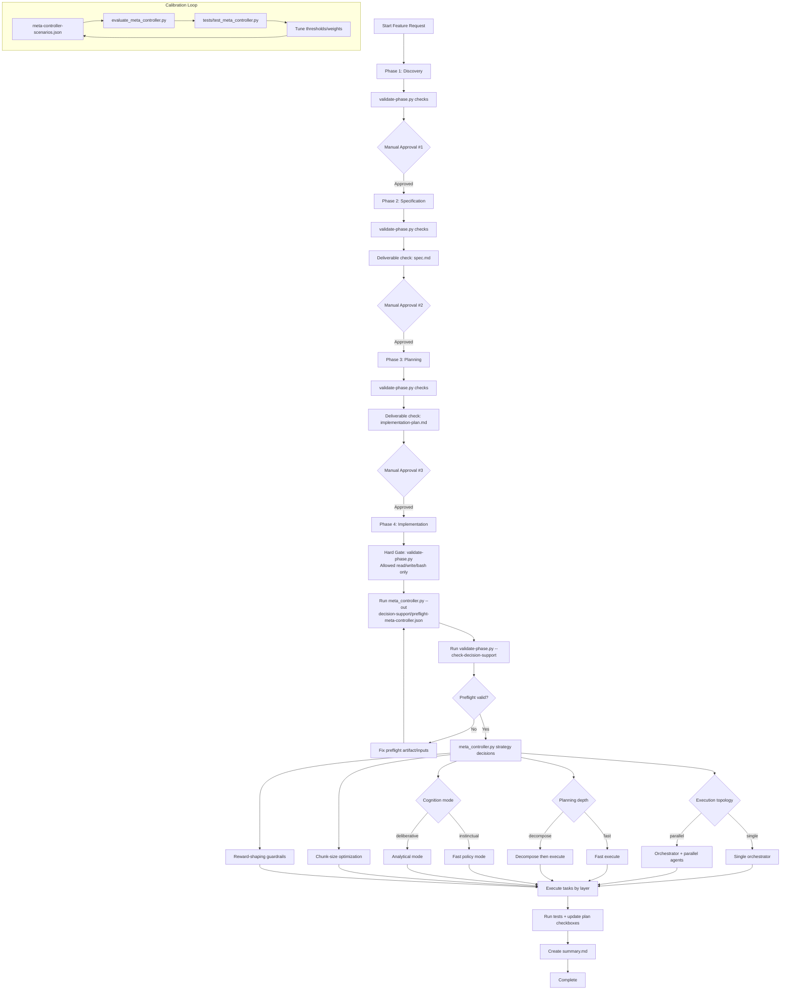

# Meta-Controller: Technical First, Then Intuition

This document explains what the policy is mathematically doing in `scripts/meta_controller.py`, then gives an analogy layer for mixed audiences.

## Why We Introduced This

The feature workflow already provides strong governance (phase gates, permissions, required artifacts), but strategy selection inside those gates can still be implicit and person-dependent.

We introduced this approach to make strategy decisions:

- explicit (not tribal knowledge),
- measurable (scored and testable),
- repeatable (same inputs, same recommendation),
- tunable over time (weights/thresholds/scenarios can evolve).

In short: keep the workflow deterministic, and make orchestration decisions deterministic as well.

## Biological Connection (What Is Real vs Analogy)

This is **not** a biological simulation. It is an engineering control policy informed by well-known brain function patterns:

- gating allowed actions first (basal-ganglia-like selection),
- evaluating competing plans under cost/risk tradeoffs (prefrontal-like control),
- switching between fast habitual policy and slower deliberative policy based on uncertainty/risk,
- shaping behavior with reward signals.

The biological mapping is used as a design lens for modularity and interpretability, not as a claim of neural equivalence.

## Brain-to-System Mapping

The mapping below is intended to be useful for reasoning and communication, while remaining technically grounded:

- **Basal ganglia (action selection / inhibition)**  
  Brain function: suppresses or permits candidate actions under context and goals.  
  System analog: `validate-phase.py` plus workflow permissions. If an action is disallowed for the phase, it is blocked before optimization.

- **Prefrontal cortex (executive control / planning)**  
  Brain function: evaluates tradeoffs, handles complex goal-directed behavior, and updates plans under uncertainty.  
  System analog: objective scoring in `meta_controller.py` (`quality - penalties`) and planning-depth selection.

- **Anterior cingulate-like conflict/cost monitoring (functional analogy)**  
  Brain function: tracks conflict, expected effort, and control demand.  
  System analog: explicit cost terms (`time`, `compute`, `risk`, `merge`) and adaptive weights (`λ`) that increase penalties when risk or urgency is high.

- **Habitual vs deliberative systems (dual-process control)**  
  Brain function: fast policy reuse for familiar low-risk contexts; slower controlled reasoning for novel/high-risk contexts.  
  System analog: instinctual vs deliberative mode gate based on confidence, novelty, and blast radius thresholds.

- **Dopaminergic reward prediction and policy biasing (functional analogy)**  
  Brain function: reinforces behaviors associated with better outcomes.  
  System analog: reward shaping for parallel execution, but only when quality/rework guardrails are satisfied.

Why this helps: it separates the pipeline into interpretable control primitives (gate, evaluate, choose, reinforce), which makes policy behavior easier to audit and tune.

## Current Components: Software Role + Biological Analog

This section connects the current implementation artifacts directly to control-system functions and biological analogs.

### `references/feature-workflow.yaml`

- **Software role:** declarative policy model (state machine + constraints)
- **What it contains:** phase definitions, read/write/bash permissions, deliverables, transitions, manual approval boundaries
- **Control-theory view:** policy prior and admissible action set
- **Biological analog:** cortical rule representation (task-set/context model)
- **Why it matters:** prevents local optimizers from selecting actions outside governance

### `scripts/validate-phase.py`

- **Software role:** deterministic policy enforcement engine
- **What it does:** validates feature naming, file read/write permissions, command allow/deny checks, deliverable completion checks
- **Control-theory view:** hard feasibility filter (`Action ∈ AllowedSet(phase)`)
- **Biological analog:** basal-ganglia-like Go/No-Go gating
- **Why it matters:** converts policy into executable constraints and blocks invalid transitions/actions

### `scripts/meta_controller.py`

- **Software role:** constrained strategy optimizer
- **What it does:** computes action scores, selects execution topology, planning depth, cognition mode, chunking, and reward-shaping status
- **State source behavior:** can infer core state fields from `implementation-plan.md` (task breakdown/file markers/layer coverage) when running preflight output into `decision-support/`
- **Control-theory view:** argmax policy under constraints (`argmax Score(a|x)` subject to validator gate)
- **Biological analog:** prefrontal executive arbitration with cost/risk integration
- **Why it matters:** makes orchestration strategy explicit, inspectable, and tunable

### `scripts/evaluate_meta_controller.py`

- **Software role:** policy evaluation harness
- **What it does:** runs fixed scenarios, compares outputs to expected decisions, reports mismatch and distribution metrics
- **Control-theory view:** offline policy validation / calibration monitor
- **Biological analog:** performance-feedback loop (outcome monitoring and policy correction)
- **Why it matters:** detects drift and prevents silent behavior regression after tuning

### `references/meta-controller-scenarios.json`

- **Software role:** benchmark state distribution + expected policy labels
- **What it contains:** representative contexts and expected decision assertions
- **Control-theory view:** regression oracle for policy behavior
- **Biological analog:** memory of prior task contexts used to stabilize future policy
- **Why it matters:** ensures future changes preserve intended strategic behavior

### `tests/test_meta_controller.py`

- **Software role:** executable invariants
- **What it does:** enforces guardrail properties (phase gate, parallel conditions, threshold behavior, scenario mismatch = 0)
- **Control-theory view:** formalized safety/property checks
- **Biological analog:** robust homeostatic constraints (prevent unstable policy excursions)
- **Why it matters:** catches policy defects early in development cycles

## Component Interaction Flow

At runtime, the flow is:

1. `feature-workflow.yaml` defines what is legal in the current phase.
2. `validate-phase.py` enforces legality before execution decisions.
3. `meta_controller.py` infers/loads state and optimizes strategy only within legal actions.
4. `evaluate_meta_controller.py` + tests validate that policy behavior remains aligned over time.

In biology terms: represent context -> gate possible actions -> choose policy -> monitor outcomes -> recalibrate.

## What We Are Trying to Get Out of This

Operationally, we want better decisions on:

1. when to run single-agent vs parallel-agent execution,
2. when to execute immediately vs spend more planning budget,
3. when fast heuristic behavior is safe vs when deep reasoning is required,
4. how to batch work into chunks that reduce coordination and rework,
5. how to incentivize useful parallelism without rewarding unsafe complexity.

Success looks like:

- fewer avoidable regressions in high-blast changes,
- faster throughput on low-coupling tasks,
- clearer rationale for orchestration decisions,
- stable behavior under regression scenarios.

## System Role

The workflow already has a deterministic permission gate:

- `feature-workflow.yaml`: policy definition
- `validate-phase.py`: phase permission checker (`read/write/bash`)

The meta-controller solves a different problem: **optimal action selection among allowed options**.

## Formal Decision Model

Given state `x` and candidate action `a`, the controller computes:

`Score(a|x) = Q(a|x) - λt*T(a|x) - λc*C(a|x) - λr*R(a|x) - λm*M(a|x) + Bparallel(a|x)`

Where:

- `Q`: expected solution quality
- `T`: normalized completion time
- `C`: normalized compute/agent cost
- `R`: normalized risk term (failure probability weighted by impact/blast radius)
- `M`: integration/merge overhead
- `Bparallel`: workload-scaled throughput bonus for parallel candidates
- `λ*`: context-sensitive penalty weights derived from urgency/risk/coupling

Policy output is `argmax_a Score(a|x)` under phase constraints.

## Input State Vector

The model state (`DecisionState`) is:

- `phase`, `task_count`
- `parallelizable_fraction`, `coupling`
- `novelty`, `confidence`
- `blast_radius`, `failure_impact`
- `deadline_pressure`, `compute_budget`

All non-count fields are normalized to `[0,1]`.

State sourcing during preflight:

1. Start with inferred fields from `implementation-plan.md` when available.
2. Overlay `--state-file` if provided.
3. Overlay `--state-json` if provided.
4. Apply explicit `--phase` override last.

## Decision Modules

### 1) Execution topology: single orchestrator vs parallel agents

Time estimate is Amdahl-inspired with workload pressure:

`w = clamp((task_count - 8)/32)`
`Tn = ((1-p) + p/n) + Tcoord(n)*(1-0.35w) + 0.5*Tmerge(n)*(1-0.50w)`

- `p`: parallelizable fraction
- `n`: number of agents
- `w`: workload pressure derived from task volume
- `Tcoord` increases with communication complexity and novelty
- `Tmerge` increases with number of branches/merge surfaces and coupling

Each candidate `n` gets `Q,T,C,R,M`; score is computed; top score wins.
Score also includes a throughput term for larger workloads:

`Score'(n) = Score(n) + 0.055*w*p*log2(n)`

There is also a **minimum margin** (`parallel_margin_min`) to avoid noisy flips from single to parallel.
For highly entangled high-risk states (very high coupling + novelty + blast radius + failure impact), candidate search collapses to single orchestrator.

#### Worked Example: Single vs Parallel (n=1 vs n=3)

Assume a phase-4 state with moderately parallelizable work:

- `p=0.8`, moderate coupling/novelty
- derived weights: `λt=0.22`, `λc=0.11`, `λr=0.30`, `λm=0.14`

Suppose the metric estimator returns:

- `n=1`: `Q=0.66`, `T=1.20`, `C=0.15`, `R=0.24`, `M=0.00`
- `n=3`: `Q=0.72`, `T=1.05`, `C=0.45`, `R=0.29`, `M=0.18`

Now score both (using `Bparallel=0` for a small/medium workload example):

`Score1 = 0.66 - 0.22*1.20 - 0.11*0.15 - 0.30*0.24 - 0.14*0.00`
`Score1 = 0.3075`

`Score3 = 0.72 - 0.22*1.05 - 0.11*0.45 - 0.30*0.29 - 0.14*0.18`
`Score3 = 0.3263`

Margin:

`Δ = Score3 - Score1 = 0.0188`

Decision rule:

- if `Δ > parallel_margin_min` (default `0.012`), choose parallel (`n=3`)
- else choose single (`n=1`)

In this example, `0.0188 > 0.012`, so the controller recommends parallel.

### 2) Planning depth: fast execute vs decomposition

For depth `k`, utility is:

`U(k) = P(success|k)*Vsuccess - λt*PlanningOverhead(k)`
`VOC(k) = U(k) - U(k-1)`

The chosen depth is `k* = argmax_k U(k)`.
If `k* <= 1`, policy recommends fast execution; otherwise decomposition first.

### 3) Cognition mode: instinctual vs deliberative

A score and hard thresholds are used:

`InstinctScore = 1.15*confidence - 0.95*novelty - 0.85*blast_radius - 0.55*failure_impact`

Instinctual mode requires:

- `confidence >= instinct_confidence_min`
- `novelty <= instinct_novelty_max`
- `blast_radius <= instinct_blast_radius_max`
- `InstinctScore > 0`

Else deliberative mode.

### 4) Chunk-size optimization

Objective:

`J(b) = alpha*(N/b) + beta*(b^gamma/N) + delta*DependencyCut(b)`

- first term penalizes too many tiny chunks (coordination overhead)
- second penalizes large chunks (rework/latency concentration)
- third penalizes dependency-crossing chunk structure

Choose `b* = argmin_b J(b)`.

### 5) Reward shaping for parallel preference

Base reward:

`Rbase = Q - λt*T - λc*C - λr*R`

Shaped reward:

`Rshaped = Rbase + β * I(parallel ∧ quality>=floor ∧ rework<=ceiling)`

This means parallelism is rewarded only when quality and rework guardrails are satisfied.

## Integration with Phase Workflow

This is the key governance link:

1. Meta-controller checks whether parallel execution is allowed via `validate-phase.py`.
2. In non-implementation phases (typically 1-3), parallel worker expansion is blocked.
3. In phase 4, state is inferred from `implementation-plan.md` unless explicitly overridden.
4. In phase 4, full candidate search is enabled (except high-risk entanglement fallback to single mode).

So optimization occurs **inside** the phase-based safety envelope, never outside it.

## What to Monitor During Iteration

Use scenario fixtures + tests:

```bash
python3 .claude/skills/feature-request/scripts/evaluate_meta_controller.py --fail-on-mismatch
python3 -m unittest discover -s .claude/skills/feature-request/tests -p "test_*.py"
```

Primary tuning knobs:

- `parallel_margin_min`
- instinct thresholds
- reward bonus/guardrails (`parallel_reward_beta`, quality floor, rework ceiling)
- weight sensitivity to urgency/risk/coupling

## Iteration Model (How This Improves Over Time)

Treat this as a policy calibration loop:

1. capture real feature outcomes (lead time, regressions, rework, incident risk),
2. encode representative states and expected decisions into scenario fixtures,
3. run evaluator + tests to detect policy drift,
4. tune parameters (weights, thresholds, margins),
5. rerun and compare distribution changes (single vs parallel, instinct vs deliberative, planning depth).

This provides a controlled way to move from intuition to evidence-backed orchestration.

## Decision and Phase Flow

### ASCII Flow

```text
[Start Feature Request]
         |
         v
+----------------------+
| Phase 1: Discovery   |
| - Read-only explore  |
| - Propose feature id |
+----------------------+
         |
         v
 [Manual Approval #1]
         |
         v
+--------------------------+
| Phase 2: Specification   |
| - Write spec.md only     |
| - Validate deliverables  |
+--------------------------+
         |
         v
 [Manual Approval #2]
         |
         v
+----------------------------------+
| Phase 3: Implementation Planning |
| - Write implementation-plan.md   |
| - Define tasks/layers/tests      |
+----------------------------------+
         |
         v
 [Manual Approval #3]
         |
         v
+-----------------------------------------+
| Phase 4: Implementation                 |
| validate-phase.py gate (allow/deny)     |
+-----------------------------------------+
         |
         v
+-------------------------------------------------------------+
| REQUIRED PREFLIGHT                                           |
| 1) Run meta_controller.py --out decision-support/*.json      |
| 2) validate-phase.py --check-decision-support                |
|    (artifact + JSON key checks)                              |
+-------------------------------------------------------------+
         |
         v
   [Preflight Valid?]
      /         \
    No           Yes
    |             |
    v             v
[Fix preflight]  +----------------------------------------------+
   |             | Strategy decisions from meta_controller.py   |
   +------------>| 1) single vs parallel agents                 |
                 | 2) fast execute vs decomposition depth       |
                 | 3) instinctual vs deliberative mode          |
                 | 4) chunk size / batching                     |
                 | 5) reward-shaping eligibility                |
                 +----------------------------------------------+
         |
         v
[Execute tasks + update checkboxes + tests]
         |
         v
[Create summary.md]
         |
         v
[Done]

Calibration loop (continuous):
  scenarios.json + evaluate_meta_controller.py + tests/test_meta_controller.py
            -> detect drift -> tune thresholds/weights -> re-run
```

### Mermaid Flow



## Intuition Layer (Analogy, Not Replacement)

- **Phase validator = basal ganglia gate:** allowed vs blocked actions.
- **Meta-controller = prefrontal arbitration:** evaluates tradeoffs under uncertainty.
- **Instinct thresholding = habit policy retrieval:** use learned fast policy only in low-novelty, low-blast contexts.
- **Reward shaping = dopaminergic biasing:** reinforce strategies that are efficient *and* safe, not merely active.

This keeps the system both technically grounded and explainable to non-specialists.
