# Auto Shipper AI

An autonomous, capital-light commerce system that discovers, validates, launches, and scales profitable physical and digital products. The system operates **demand-first**: no production or sourcing before validated demand. The mandate is **durable net profit**, not revenue or growth.

---

## How It Works

Auto Shipper AI is an autonomous commerce engine designed to handle the entire product lifecycle:

**Implemented today:**

1. **Verify costs** — build a 13-component cost envelope with live shipping rates from carriers, payment fees from processors, and platform fees from marketplaces
2. **Stress-test margins** — simulate worst-case scenarios (2x shipping, CAC spikes, refunds, chargebacks) and enforce gross >= 50%, net >= 30%
3. **Price dynamically** — set initial price, then react to cost signals (shipping, vendor, CAC, platform fee changes) with auto-adjust, auto-pause, or auto-terminate decisions
4. **Govern vendors** — register vendors, enforce onboarding checklists, monitor SLA breaches on a 30-day rolling window, compute reliability scores, and auto-suspend vendors that exceed breach thresholds

**Planned (specs written, not yet built):**

5. **Discover demand** — validate willingness to pay before committing to any product
6. **Fulfill with automation** — route orders to vendors, track in real-time, trigger auto-refunds if SLA is breached
7. **Protect capital** — maintain a rolling reserve, monitor daily margins, auto-pause or terminate SKUs that breach profitability thresholds
8. **Reallocate intelligently** — scale winners, kill losers, reinvest freed capital into highest-return opportunities

### Product Flow

```mermaid
---
title: Commerce Engine — Product & Data Flow
---
flowchart TD
    subgraph DISCOVERY["🔍 Discovery & Validation"]
        D1([Demand Signal Ingestion])
        D2{Willingness<br/>to Pay Validated?}
        D3([Pre-sell / Waitlist / Survey])
        D1 --> D2
        D2 -- No --> KILL0([❌ Terminate Idea])
        D2 -- Yes --> D3
        D3 --> CG
    end

    subgraph CG["🔒 Cost Gate — catalog module"]
        CG1([Build Cost Envelope])
        CG2([Fetch Live Rates<br/>UPS · FedEx · USPS<br/>Stripe · Shopify])
        CG3{All Components<br/>Verified?}
        CG4([Run Stress Test<br/>2× ship · +15% CAC<br/>+10% supplier · 5% refund<br/>2% chargeback])
        CG5{Gross ≥ 50%<br/>Net ≥ 30%?}
        CG1 --> CG2 --> CG3
        CG3 -- No --> KILL1([❌ Terminate SKU<br/>Unverified Costs])
        CG3 -- Yes --> CG4 --> CG5
        CG5 -- Fail --> KILL2([❌ Terminate SKU<br/>Margin Below Floor])
        CG5 -- Pass --> LAUNCH
    end

    subgraph LAUNCH["🚀 Launch — catalog + pricing modules"]
        L1([Construct LaunchReadySku<br/>StressTestedMargin ✓<br/>CostEnvelope.Verified ✓])
        L2([Set Initial Price<br/>WTP ceiling → backward induction])
        L3([Activate on Platform<br/>Shopify · Amazon · etc.])
        L1 --> L2 --> L3
    end

    subgraph VENDOR["🏭 Vendor — vendor module"]
        V1([Vendor Registry])
        V2([SLA Confirmation])
        V3([Reliability Scoring])
        V4{SLA Breach<br/>> Tolerance?}
        V1 --> V2 --> V3 --> V4
        V4 -- Yes --> PAUSE1([⏸ Auto-Pause SKU<br/>VendorSlaBreached event])
        V4 -- No --> V3
    end

    subgraph FULFILLMENT["📦 Fulfillment — fulfillment module"]
        F1([Order Received])
        F2([Inventory Sync Check])
        F3{Stock<br/>Available?}
        F4([Route to Vendor<br/>Drop-ship · POD · 3PL])
        F5([Real-time Tracking])
        F6([Delay Alert<br/>if SLA at risk])
        F7{SLA<br/>Breached?}
        F8([Auto-Refund Trigger])
        F1 --> F2 --> F3
        F3 -- No --> F8
        F3 -- Yes --> F4 --> F5 --> F6 --> F7
        F7 -- Yes --> F8
        F7 -- No --> F5
    end

    subgraph PRICING["💲 Pricing Engine — pricing module"]
        P1([PricingSignal Listener<br/>Shipping · CAC · Vendor · Platform])
        P2([Recalculate Margin])
        P3{Decision}
        P4([Adjust Price])
        P5([⏸ Pause SKU])
        P6([❌ Terminate SKU])
        P1 --> P2 --> P3
        P3 -- Adjusted --> P4
        P3 -- PauseRequired --> P5
        P3 -- TerminateRequired --> P6
    end

    subgraph CAPITAL["🏦 Capital Protection — capital module"]
        CA1([10–15% Rolling Reserve])
        CA2([90-Day Margin Monitor])
        CA3([SKU-Level P&L Dashboard])
        CA4{Kill Rule<br/>Triggered?}
        CA5([Reallocate Capital<br/>to Higher-Return SKUs])
        CA2 --> CA4
        CA4 -- Yes --> KILL3([❌ Auto-Terminate SKU])
        CA4 -- No --> CA5
    end

    subgraph PORTFOLIO["📊 Portfolio Engine — portfolio module"]
        PO1([Experiment Tracker<br/>Monthly test budget])
        PO2([Scale Winners])
        PO3([Kill Losers<br/>30-day window])
        PO4([Branded Vertical<br/>Conversion])
        PO5([Subscription / Digital Layer])
        PO1 --> PO2 & PO3
        PO2 --> PO4 --> PO5
    end

    subgraph FEEDBACK["🔄 Data & Feedback Loop — shared / analytics"]
        FB1([Conversion Rates])
        FB2([CAC Trends])
        FB3([Refund Drivers])
        FB4([Vendor Metrics])
        FB5([Margin Signals])
        FB6([Self-Correction Engine])
        FB1 & FB2 & FB3 & FB4 & FB5 --> FB6
        FB6 --> PRICING & CAPITAL & PORTFOLIO
    end

    %% Cross-module connections
    D3 --> VENDOR
    LAUNCH --> FULFILLMENT
    LAUNCH --> PRICING
    LAUNCH --> CAPITAL
    FULFILLMENT --> FEEDBACK
    VENDOR --> FEEDBACK
    PRICING --> FEEDBACK
    CAPITAL --> PORTFOLIO
    PORTFOLIO --> DISCOVERY

    %% Styling
    classDef kill fill:#ffcccc,stroke:#cc0000,color:#000
    classDef pause fill:#fff0cc,stroke:#cc8800,color:#000
    classDef pass fill:#ccffcc,stroke:#007700,color:#000
    classDef module fill:#e8f0fe,stroke:#4a6fa5,color:#000
    classDef event fill:#f0e8fe,stroke:#6a4fa5,color:#000

    class KILL0,KILL1,KILL2,KILL3 kill
    class PAUSE1,P5 pause
    class L1,L2,L3 pass
```



---

## Why This Approach?

Most e-commerce systems launch first and optimize later. Auto Shipper AI **validates before building**:

| Traditional | Auto Shipper AI |
|---|---|
| Guess at carrier costs | Fetch live rates from UPS, FedEx, USPS APIs |
| Founder gut-feel on margins | Stress test all products to 50% gross / 30% net |
| Manual price adjustments | React to cost signals with auto-adjust, pause, or terminate |
| Hope suppliers deliver on time | Monitor SLA and auto-pause on breach |
| Scale everything equally | Scale winners, kill losers by margin signal *(planned)* |
| Build inventory → find customers | Validate demand first *(planned)* |

**Result:** Capital efficiency, lower risk of unsellable inventory, faster failure on unprofitable products.

---

## Architecture

Modular monolith with bounded contexts, structured to promote independent services only when a module's scaling or deployment needs diverge.

```
auto-shipper-ai/
└── modules/
    ├── shared/          # Money, Percentage, domain IDs, domain events
    ├── catalog/         # SKU lifecycle, cost gate, stress test, state machine
    ├── pricing/         # Dynamic pricing engine, cost signal processing
    ├── vendor/          # Vendor registry, SLA monitoring, reliability scoring
    ├── fulfillment/     # Order routing, carrier integration, tracking, delay alerts
    ├── capital/         # Reserve management, margin dashboards, kill-rule execution
    ├── compliance/      # IP checks, regulatory guards, processor rule validation
    ├── portfolio/       # Experiment tracking, scale/kill orchestration, reinvestment
    └── app/             # Spring Boot entry point, Flyway migrations, config
```

## Tech Stack

| Layer | Technology |
|---|---|
| Language | Kotlin (JVM 21) |
| Framework | Spring Boot 3.x |
| Database | PostgreSQL 16 + Flyway |
| Events | Spring `ApplicationEventPublisher` |
| Scheduling | Spring `@Scheduled` |
| Observability | Micrometer + Prometheus |
| Frontend | React + Vite + shadcn/ui *(planned)* |

## Prerequisites

- Java 21 (Temurin recommended)
- PostgreSQL 16 running on `localhost:5432`
- Gradle 8.8 (wrapper included — no local install required)

## Local Setup

**1. Create the database:**

```bash
# Create a database user with a strong password (use a real secure password)
psql -U postgres -c "CREATE USER autoshipper WITH PASSWORD 'your_secure_password_here';"

# Create development and test databases
psql -U postgres -c "CREATE DATABASE autoshipper OWNER autoshipper;"
psql -U postgres -c "CREATE DATABASE autoshipper_test OWNER autoshipper;"
```

**2. Configure environment:**

```bash
cp .env.example .env
```

Edit `.env` with your credentials (use a `.env` file that's not committed to git):
- Set `DB_PASSWORD` and `TEST_DB_PASSWORD` to the password you created above
- Leave external API keys empty for now (required for Phase 2+)
- **Do not commit `.env`** — it's in `.gitignore`

**3. Build and run:**

```bash
./gradlew build          # compile + test
./gradlew bootRun        # start the application
```

The API will be available at `http://localhost:8080`.

## Build Commands

```bash
./gradlew build              # full build + all tests
./gradlew build -x test      # compile only, skip tests
./gradlew :shared:test       # shared module unit tests only
./gradlew :app:test          # integration tests (requires PostgreSQL)
./gradlew bootRun            # run the application
./gradlew flywayMigrate      # run database migrations manually
```

## Key Business Rules

- **No inventory ownership** unless a documented risk-adjusted return analysis justifies an exception
- **No SKU listed without a fully verified cost envelope** — all 13 cost components must be verified (not estimated)
- **Net margin floor: 30%** after stress testing; gross margin target: 50%+
- **Rolling reserve: 10–15% of revenue** maintained at all times
- **Automated shutdown triggers:** margin below 30% for 7+ days, refund rate > 5%, chargeback rate > 2%, vendor SLA breach

## SKU Lifecycle

```
Ideation → ValidationPending → CostGating → StressTesting → Listed → Scaled
                                                                ↓
                                                    Paused / Terminated
```

Every transition is validated by `SkuStateMachine`, emits a domain event, and is written to the `sku_state_history` audit log. Invalid transitions throw `InvalidSkuTransitionException` — they never silently succeed.

## Stress Test Gate

Before a SKU can be listed it must survive:

| Stress Factor | Multiplier |
|---|---|
| Shipping cost | 2× |
| CAC | +15% |
| Supplier cost | +10% |
| Refund rate | 5% |
| Chargeback rate | 2% |

**Pass criteria:** gross margin ≥ 50% **and** protected net margin ≥ 30%. Fail = terminated, no override.

## API Endpoints

Interactive API docs are available via Swagger UI at **`http://localhost:8080/swagger-ui.html`** when the application is running. Raw OpenAPI spec at `/v3/api-docs`.

| Method | Path | Description |
|---|---|---|
| `POST` | `/api/skus` | Create a new SKU |
| `GET` | `/api/skus/{id}` | Get SKU detail |
| `GET` | `/api/skus?state=Listed` | List SKUs by state |
| `POST` | `/api/skus/{id}/state` | Transition SKU to a new state |
| `POST` | `/api/skus/{id}/verify-costs` | Trigger cost gate verification |
| `POST` | `/api/skus/{id}/stress-test` | Run stress test |
| `GET` | `/api/skus/{id}/pricing` | Current price, margin, and pricing history |
| `POST` | `/api/vendors` | Register a new vendor |
| `GET` | `/api/vendors` | List all vendors |
| `GET` | `/api/vendors/{id}` | Get vendor detail |
| `PATCH` | `/api/vendors/{id}/checklist` | Update vendor onboarding checklist |
| `POST` | `/api/vendors/{id}/activate` | Activate a vendor (requires completed checklist) |
| `POST` | `/api/vendors/{id}/score` | Compute vendor reliability score |
| `GET` | `/actuator/health` | Health check |
| `GET` | `/actuator/prometheus` | Prometheus metrics |

## Environment Variables

See `.env.example` for all available configuration. Key variables:

| Variable | Description |
|---|---|
| `DB_URL` | PostgreSQL JDBC URL (default: `jdbc:postgresql://localhost:5432/autoshipper`) |
| `DB_USERNAME` | Database user (must match your local setup) |
| `DB_PASSWORD` | Database password (must be set securely) |
| `SHOPIFY_API_KEY` | Shopify storefront integration (Phase 2+) |
| `SHOPIFY_API_SECRET` | Shopify API secret (Phase 2+) |
| `STRIPE_SECRET_KEY` | Stripe payment processing (Phase 2+) |
| `UPS_API_KEY` | UPS carrier rate API (Phase 2+) |
| `FEDEX_API_KEY` | FedEx carrier rate API (Phase 2+) |
| `USPS_API_KEY` | USPS carrier rate API (Phase 2+) |

**Never commit `.env` to version control.** It is listed in `.gitignore`.

## Database Migrations

Migrations live in `modules/app/src/main/resources/db/migration/` and run automatically on startup via Flyway.

| Version | Description |
|---|---|
| V1 | Baseline — UUID extension |
| V2 | Catalog SKU lifecycle (`skus`, `sku_state_history`) |
| V3 | Cost envelopes — all 13 cost components |
| V4 | Stress test results |
| V5 | Unique constraint on `sku_cost_envelopes(sku_id)` |
| V6 | Seed data for local development |
| V7 | Pricing tables (`sku_prices`, `sku_pricing_history`) |
| V8 | Running cost + optimistic locking on `sku_prices` |
| V9 | Vendor governance (`vendors`, `vendor_sku_assignments`, `vendor_breach_log`) |

## Feature Requests

Implementation is tracked in `feature-requests/FR-NNN-name/` with a `spec.md`, `implementation-plan.md`, and `summary.md` (once complete).

| FR | Name | Status |
|---|---|---|
| FR-001 | Shared domain primitives | ✅ Complete |
| FR-002 | Project bootstrap | ✅ Complete |
| FR-003 | Catalog SKU lifecycle | ✅ Complete |
| FR-004 | Catalog cost gate | ✅ Complete |
| FR-005 | Catalog stress test | ✅ Complete |
| FR-006 | Pricing engine | ✅ Complete |
| FR-007 | Vendor governance | ✅ Complete |
| FR-008 | Fulfillment orchestration | Spec'd |
| FR-009 | Capital protection | Spec'd |
| FR-010 | Portfolio orchestration | Spec'd |
| FR-011 | Compliance guards | Spec'd |
| FR-012 | Frontend dashboard | Spec'd |
| FR-013 | Project structure refactor | ✅ Complete |
| FR-014 | Spec architecture audit | ✅ Complete |
| FR-015 | Validate State Machine | ✅ Complete |
