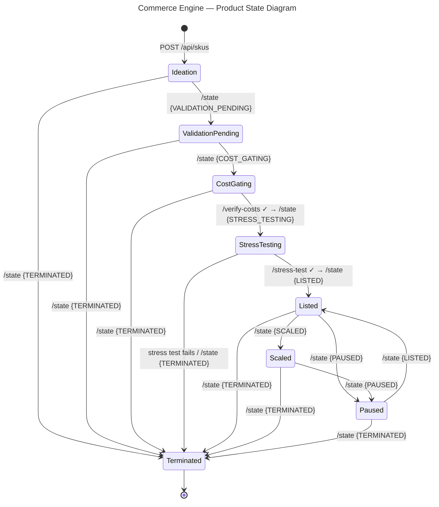

# Endpoint Test Results — 2026-03-04

## State Machine

## Fix Applied

**`kotlin("plugin.jpa")` was missing** from `:catalog` and `:pricing` modules. This caused `No default constructor for entity 'Sku'` at runtime. Fixed by adding the plugin to both `build.gradle.kts` files.

## Endpoint Test Results

| # | Endpoint | Test | Result |
|---|---|---|---|
| 1 | `GET /api/skus` | List all SKUs | **PASS** — returns all 6 SKUs |
| 2 | `POST /api/skus` | Create SKU | **PASS** — created 2 new SKUs in IDEATION |
| 3 | `GET /api/skus/{id}` | Get by ID | **PASS** |
| 4 | `POST /api/skus/{id}/state` | IDEATION → VALIDATION_PENDING | **PASS** |
| 5 | `POST /api/skus/{id}/state` | VALIDATION_PENDING → COST_GATING | **PASS** |
| 6 | `POST /api/skus/{id}/verify-costs` | Verify cost envelope | **BLOCKED** — requires live FedEx/UPS/USPS API keys |
| 7 | `POST /api/skus/{id}/stress-test` | Pass scenario ($89.99, 53.72% margin) | **PASS** — auto-transitions to LISTED |
| 8 | `POST /api/skus/{id}/state` | LISTED → PAUSED | **PASS** |
| 9 | `POST /api/skus/{id}/state` | PAUSED → LISTED (resume) | **PASS** |
| 10 | `POST /api/skus/{id}/state` | Any → TERMINATED | **PASS** (sets MANUAL_OVERRIDE reason) |
| 11 | `GET /api/skus?state=Listed` | Filter by state | **PASS** |
| 12 | `GET /api/skus/{id}/pricing` | Get pricing data | **404** — no initial price record created |
| 13 | Invalid transition (IDEATION → LISTED) | State machine guard | **PASS** (rejects, but returns 500 instead of 400/409) |

## Issues Found

### Issue 1: `kotlin("plugin.jpa")` missing from `:catalog` and `:pricing`
- **Severity:** Critical (app crashes on any JPA read)
- **Status:** Fixed — added `kotlin("plugin.jpa")` to both `modules/catalog/build.gradle.kts` and `modules/pricing/build.gradle.kts`

### Issue 2: No stub carrier rate providers for local development
- **Severity:** High (blocks local testing of cost gate flow)
- **Detail:** `verify-costs` requires live API keys for FedEx, UPS, and USPS. All three adapters are `@Component` with no `@Profile("local")` fallback or `@ConditionalOnProperty` toggle. Unit tests use Mockito, but integration/manual testing is impossible without credentials.

### Issue 3: Initial pricing never gets set when SKU is listed
- **Severity:** High (pricing endpoint always returns 404)
- **Detail:** `PricingEngine.setInitialPrice()` exists but nothing invokes it. There is no `@EventListener` for `SkuStateChanged` that triggers price initialization when `toState == LISTED`. The stress test computes an estimated price and returns a `LaunchReadySku`, but that data is never forwarded to the pricing module.

### Issue 4: Invalid state transitions return 500 instead of 400/409
- **Severity:** Medium (poor API ergonomics)
- **Detail:** `InvalidSkuTransitionException` is thrown by `SkuStateMachine.validate()` but is not mapped to an HTTP error response. Spring defaults to 500 Internal Server Error. Should return 400 Bad Request or 409 Conflict with a meaningful error body.
