# NR-002: System Now Auto-Lists on Shopify — And Every External API is Now Verified

**Date:** 2026-03-20
**Linear:** RAT-13 (Done), RAT-15 (Done), RAT-24 (Created), RAT-25 (Created)
**Status:** Completed

---

## TL;DR

Two milestones in one day. First, the system now automatically creates Shopify listings the moment a SKU passes all gates, and automatically pulls them when margins breach — closing Gap #2 from PM-007. Second, we built and shipped automated verification for all 4 demand signal integrations (CJ, YouTube, Reddit, Google Trends), proving they're calling the real APIs correctly. That verification process caught two real bugs in the Reddit integration that would have caused silent failures in production. The API contract confidence gap flagged earlier today is now half-closed — demand sources are verified, Shopify verification (RAT-24) is next.

## What Changed

### Phase 1: Shopify Auto-Listing (RAT-13)

- **Automatic Shopify listing on SKU launch** — when a SKU clears compliance, cost verification, and stress test (50%+ gross / 30%+ net margin floor), it transitions to Listed and the system immediately creates a product on Shopify with the correct title, category, price, and SKU identifier. Zero manual intervention.

- **Automatic listing pause on margin breach** — when the capital protection system detects 7+ days below the 30% net margin floor and auto-pauses a SKU, the Shopify listing is simultaneously set to draft (invisible to customers). Previously, a pause would stop internal operations but the product would remain live and sellable on Shopify.

- **Automatic listing archive on termination** — when a SKU is terminated (refund rate > 5%, chargeback rate > 2%, or kill window breach after 30+ days negative), the Shopify listing is archived permanently.

- **Price sync consolidation** — when the pricing engine adjusts a price (e.g., cost signal from a supplier increase), the Shopify variant price is now updated through the same unified integration. Existing SKUs that were listed before this change continue to work via a backward-compatible path.

- **End-to-end validated** — ran the full lifecycle locally: SKU creation → compliance clear → cost gate ($58.45 fully burdened) → stress test pass (62% margin at $199.99) → auto-listed on Shopify (ACTIVE) → inserted degraded margin data (25% net, 7 days) → margin sweep fired → auto-paused → Shopify listing set to DRAFT. Every step verified.

### Phase 2: API Contract Verification for Demand Sources (RAT-15)

- **Every demand signal integration now has automated API verification** — 27 new tests that replay recorded real API responses against our actual integration code. These verify we're calling the APIs correctly, sending the right headers, and parsing responses properly. Covers CJ Dropshipping (5 tests), Google Trends (3 tests), YouTube Data API (4 tests), and Reddit (4 tests).

- **All test data verified against official API documentation** — we researched each API's published docs and built the test data to match real response formats. This caught that our CJ Dropshipping test assumptions were wrong (that API returns success status codes even for errors — the error is embedded in the response body), and that our Reddit test data had incorrect token expiry timing.

- **Post-deploy health check endpoint** — a new diagnostic endpoint that probes all 4 demand sources simultaneously and reports which ones are healthy, which have authentication problems, which are timing out, and which are rate-limited. Disabled by default, can be enabled per-environment. Rate-limited to once per minute to prevent burning through API quotas. This gives us a one-click way to verify all integrations are working after any deployment.

- **Two real bugs found and fixed in the Reddit integration:**
  1. **Token expiry misconfiguration** — if Reddit's authentication response ever omitted the token lifetime field, the system would cache the token for 24 hours when Reddit tokens actually expire after 1 hour. This means 23 hours of failed API calls with no automatic recovery. Fixed.
  2. **Authentication failure crashes the pipeline** — if Reddit's authentication server returned an error, the entire demand scan would crash instead of gracefully skipping Reddit and continuing with the other 3 sources. Now it logs a warning and moves on.

- **Automated PR review caught a diagnostic gap** — the health check endpoint was reporting "UNKNOWN" as the source name when a provider timed out, which defeats the purpose of per-source diagnostics. Fixed before merge.

## Autonomous Pipeline — Where We Are

6 of 8 stages fully autonomous. Marketing/SEO is the last piece before autonomous revenue.

## 3 Bugs Caught Before Production

Three independent review layers each caught issues the others missed — no single layer would have found all three.

## Why This Matters

The Shopify auto-listing closed the last operational gap between "the system makes decisions" and "the system acts on them." The full autonomous loop now runs: discover → validate → price → list → monitor → pause/kill.

The API contract verification addresses the risk we identified earlier today: all our tests were only verifying internal logic, not whether we're actually talking to external services correctly. The Reddit bugs are a perfect example — our internal tests all passed, but in production the system would have silently broken whenever Reddit's auth server hiccupped. Now we'd catch that kind of issue immediately in our automated build checks, before it ever reaches staging.

The verification pattern we established here (recorded responses + documentation cross-reference + health check endpoint) is the same pattern we'll apply to Shopify in RAT-24. After that, every external API call the system makes will have contract-level verification.

We documented the fixture verification lesson as PM-014 — the short version is that API test data must be built from official documentation, not from reading our own code. Reading our own code to build test data just proves the code is self-consistent, which tells you nothing about whether it matches reality.

## Status Snapshot

| Area | Status | Notes |
|------|--------|-------|
| Shopify auto-listing (FR-020) | Done | Listed, paused, archived, price sync all working |
| Demand signal pipeline | Done | 4 sources active (CJ, Google Trends, YouTube, Reddit) |
| API verification — demand sources (RAT-15) | Done | 27 tests, all 4 integrations verified against API docs, 2 Reddit bugs fixed |
| API verification — Shopify (RAT-24) | Not Started | Same pattern, applied to listing/fee/price sync integrations |
| Automated marketing/SEO (RAT-14) | Not Started | Products get listed but no organic traffic generation yet |
| User journey maps (RAT-25) | Not Started | Business flow mapping initiative |

## What's Next

1. **API contract verification for Shopify (RAT-24)** — apply the same verification pattern to all three Shopify integrations (listing, fee lookup, price sync). After this, we have confidence in every external API call the system makes. RAT-15 established the pattern; RAT-24 completes the coverage.

2. **Integration test coverage (RAT-19)** — close gaps identified across 7 prior incident reports where internal tests passed but the system broke at the seams between modules.

3. **Automated marketing & SEO (RAT-14)** — the system can now list products autonomously, but without organic traffic they won't sell. This closes the revenue loop.

4. **Backlog cleanup (RAT-21, RAT-20, RAT-16)** — one-time audits, skill tooling improvements, and demand scan enhancements. Lower priority.

## Risks & Decisions Needed

- **Shopify verification is the remaining gap:** Demand sources are now verified, but the Shopify integrations (listing, fee lookup, price sync) still have zero contract verification. Given what we found with CJ (their error behavior was completely different from what we assumed), it's reasonable to expect similar surprises with Shopify's API. → **Ask:** Still comfortable with the prioritization (Shopify verification next before marketing/SEO)?

## Session Notes

- Phase 1 (Shopify auto-listing) — the PR review bot caught a capital-protection-level bug: three of four Shopify operations would silently do nothing if API credentials were misconfigured. A margin breach could trigger a pause, the system would record it as "paused," but Shopify would keep selling the product. Fixed before merge.
- Phase 2 (API verification) — the initial test fixtures were built by reading our own code rather than the actual API docs. The user caught this before it shipped. Research agents verified all 4 APIs in parallel and found significant discrepancies in CJ and Reddit. Lesson captured as PM-014.
- Total output across both phases: 34 files shipped, 27 new tests, 1 smoke-test endpoint, 2 production bug fixes, 1 postmortem (PM-014), PR submitted.
