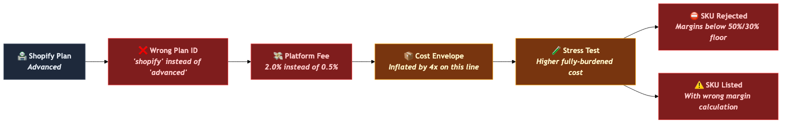
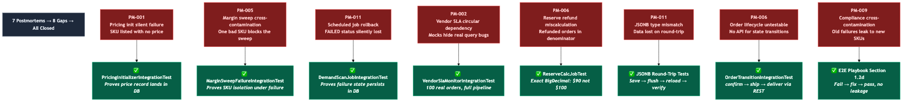

# NR-003: Shopify Verification, Fee Bug Fix, and Postmortem Test Sweep

**Date:** 2026-03-21
**Linear:** [RAT-24](https://linear.app/ratrace/issue/RAT-24), [RAT-19](https://linear.app/ratrace/issue/RAT-19)
**PRs:** [#30](https://github.com/spaceBrownie/auto-shipper-ai/pull/30), [#31](https://github.com/spaceBrownie/auto-shipper-ai/pull/31)
**Status:** Completed

---

## TL;DR

Big testing day. We verified all three Shopify integrations against their real API documentation and caught a platform fee bug that would have overcharged every non-Basic store — inflating cost envelopes and potentially killing SKUs that should pass the stress test. Then we went back through all 7 postmortems and wrote every integration test they recommended but that never got built. 40 new automated checks total (21 Shopify contract + 19 postmortem coverage), 3 bugs fixed, 3 new order lifecycle API endpoints, and the E2E playbook now covers the full system end-to-end. Every phase passed.

## What Changed

### Shopify API Verification (RAT-24)

- **21 automated API contract checks** now verify that our Shopify integrations send exactly the right requests and correctly interpret Shopify's responses — covering product creation, pause/archive, price updates, fee lookups, and error handling
- **Platform fee calculation fixed** — the system was using incorrect Shopify plan identifiers, causing every non-Basic store to fall through to the default 2% rate. The correct rates (Basic 2%, Shopify 1%, Advanced 0.5%, Plus 0%) are now enforced and verified
- **Price sync authentication fixed** — the fallback path for updating prices on Shopify was missing the authentication header, meaning it would always be rejected
- **Configuration safety hardened** — three places where missing Shopify credentials could crash the system on startup are now handled gracefully with early warnings

### Postmortem Test Coverage (RAT-19)

- **19 new automated tests** covering all 8 gaps identified across 7 postmortems — the system now catches transaction boundary bugs, silent persistence failures, and data-flow errors that unit tests structurally cannot detect
- **Pricing initialization verified end-to-end** — when a SKU reaches Listed status, the system now proves (not just assumes) that the price record actually lands in the database with the correct price, margin, and cost values. This is the PM-001 bug that would have meant a listed SKU with no price.
- **Margin sweep failure isolation proven** — if one SKU trips a shutdown rule during a multi-SKU margin sweep, the system now proves that (a) the failing SKU's margin data is still recorded and (b) every other SKU is processed normally. A single bad SKU can't take down the whole sweep.
- **Reserve calculation accuracy locked down** — the reserve percentage now provably excludes refunded orders from the denominator. Example: 9 delivered orders + 1 refunded order at 10% reserve rate = exactly $90 reserved, not $100. Getting this wrong would mean either over-reserving (locking up working capital) or under-reserving (insufficient protection).
- **Vendor breach detection tested with real data** — instead of testing against fake data that might not match real database queries, the system now inserts 100 actual order records and runs the full breach detection pipeline. With 15 delayed orders out of 100 (15% > 10% threshold), the system correctly suspends the vendor, logs the breach, and auto-pauses all linked SKUs.
- **Structured data storage verified** — demand candidate signals and rejection metadata survive the full save-to-database-and-read-back cycle. This catches the PM-011 pattern where data appeared to save correctly but was silently corrupted by a type mismatch between the application and the database.
- **3 new API endpoints for order state transitions** — confirm, ship, and deliver now available via the API, enabling the E2E playbook to test the full order lifecycle via HTTP instead of direct database manipulation. This means we can now verify the complete chain: order delivered → capital record created → reserve credited.
- **E2E playbook expanded** — added a compliance re-check scenario (fail → fix → pass, verify no cross-contamination between SKUs) and replaced all direct database order updates with the new API calls

## How the Fee Bug Cascades to Business Decisions

One wrong plan identifier inflates the platform fee, which inflates the cost envelope, which either kills a viable SKU or lists it with incorrect margins.

## Postmortem Gap Closure — 0/8 → 8/8

Every postmortem recommended specific tests. Until today, none had been written. Now all 8 gaps have automated verification.

## Why This Matters

The platform fee bug is the financial headline. Platform fees flow directly into the 13-component cost envelope, which means they affect the fully-burdened cost, the stress test, and ultimately whether a SKU gets listed at all. A SKU on an Advanced Shopify plan would have its platform fee overstated by 4x (2% vs 0.5%), inflating the cost envelope and potentially causing the stress test to reject SKUs that should pass — or worse, listing them with incorrect margin calculations. The 13 fixture files we created are now a living contract — if Shopify changes their API responses, these tests catch the mismatch before it reaches production.

The postmortem sweep is the structural headline. Every postmortem we've written has the same lesson: mocked tests pass even when the real system would silently fail. Until today, those lessons were documented but not enforced — we knew what tests to write, we just hadn't written them. Now every PM prevention recommendation has a corresponding automated test.

The reserve calculation test is a good example of the financial stakes. The system filters out refunded orders before calculating how much cash to hold in reserve. If that filter breaks, the reserve target drifts. With the zero-capital model, reserve accuracy directly affects how much revenue is available for reinvestment versus locked up as protection. A 10% error in reserve calculation compounds across the entire portfolio.

The order lifecycle endpoints close the last major E2E gap. Before today, the playbook had to update order status by writing directly to the database, which meant the entire event chain (order delivered → capital record created → reserve updated) was never actually tested end-to-end via the API. Now it is. The full E2E playbook was run manually against the live system and every phase passed — SKU creation through compliance, cost gate, stress test, listing, platform sync, order lifecycle, margin monitoring, auto-pause on breach, portfolio tracking, and demand scanning.

## Status Snapshot

| Area | Status | Notes |
|------|--------|-------|
| Shopify product listing integration | Done | Verified: create, pause, archive, price update |
| Shopify platform fee lookup | Done | Bug fixed: plan name mapping corrected for all tiers |
| Shopify price sync | Done | Bug fixed: authentication added to fallback path |
| Demand signal API verification (FR-017) | Done | CJ, Google Trends, YouTube, Reddit — all verified |
| Pricing initialization safety | Done | PM-001: SKU→Listed→price record verified |
| Margin sweep failure isolation | Done | PM-005: multi-SKU independence proven |
| Reserve calculation accuracy | Done | PM-006: refund exclusion from denominator |
| Vendor breach detection (real data) | Done | PM-002: 100 orders, full pipeline |
| Demand scan failure persistence | Done | PM-011: FAILED status survives exceptions |
| Structured data storage round-trips | Done | PM-011: demand signals + rejection metadata |
| Order lifecycle API endpoints | Done | confirm, ship, deliver — all functional |
| Order lifecycle E2E chain | Done | OrderFulfilled → capital record verified via HTTP |
| E2E playbook — compliance re-check | Done | PM-009: cross-SKU isolation verified |
| CI test count gates | Done | 10 gates total, prevents silent test skipping |
| Full E2E playbook run | Done | All phases green |

## What's Next

- **RAT-14: Organic traffic automation** — with the full listing → order → capital pipeline now verified end-to-end, the next frontier is driving traffic to those Shopify listings without ad spend
- **Consider E2E test automation** — the manual playbook is comprehensive but takes human time. Automating it as a CI job would catch integration regressions on every PR.
- **Shopify GraphQL migration planning** — Shopify's REST API is designated "legacy" as of late 2024. Not urgent (our API version still works), but worth slotting into a future cycle.

## Session Notes

- The PM-014 lesson paid off immediately on the Shopify side — researching real Shopify docs instead of trusting our own code caught all three bugs. The plan name mapping bug would have been invisible until a real store was connected.
- Three test failures during the postmortem sweep required investigation: the structured data tests needed a different database write pattern, the order tests were accidentally calling the real Shopify API (isolated it), and the margin sweep test was checking SKUs the system intentionally skips (redesigned to match actual behavior). All three were fixed before the PR.
- The full E2E run required two app restarts to trigger the margin sweep. The auto-pause sequence worked correctly: 8 days of degraded margins (25% net, below the 30% floor) → MARGIN_BREACH detected → SKU paused → platform listing set to draft. The complete chain from data to business action is verified.
- By the numbers: 40 new automated checks, 3 bugs fixed, 3 new API endpoints, 13 Shopify fixture files, 7 postmortem gaps closed. Testing backlog is clear.
