# NR-005: Go-Live Operations Plan — Stand Up, Cost Structure, and Channel Strategy

**Date:** 2026-03-21
**Linear:** RAT-26 through RAT-29 (created)
**Status:** Planning

---

## TL;DR

We're closer than it looks. The system is built — discovery, validation, listing, capital protection, all working. What's missing is four integrations that connect us to the real world: detecting sales, ordering from suppliers, tracking shipments, and emailing customers. Monthly fixed costs to go live are roughly $80. Everything else is per-sale, funded by the customer's payment. This report breaks down exactly what it costs, what's free, what channels we can sell on, and the legal setup needed before the first dollar comes in.

## How the System Works — The "Central Warehouse" Is Software

There is no physical warehouse. The Commerce Engine receives orders from every sales channel, routes them to dropshipping suppliers, and pushes tracking back to the customer. The supplier ships directly to the customer's door.

Every sales channel (Shopify, Amazon, eBay, TikTok Shop, Google Shopping) sends order notifications to the engine via webhooks. The engine checks margins, places a purchase order with the supplier (CJ Dropshipping via their API), and tracks the shipment through carrier APIs. The customer's payment covers all costs — we never front capital.

## Cost Structure — Staying Lean

### Fixed Monthly Costs

| Item | Cost | Notes |
|------|------|-------|
| Shopify Basic plan | $39/mo | Hub store, product catalog, payment processing |
| Virtual business address | $10-30/mo | Real street address, keeps home address private |
| LLC + registered agent (amortized) | ~$25/mo | $300/yr total — one-time LLC filing + annual agent fee |
| **Total fixed** | **~$75-95/mo** | |

### Free Tier Services (Stay at $0)

| Service | What It Gives Us | Free Tier Limit |
|---------|-----------------|----------------|
| CJ Dropshipping membership | Product sourcing, order placement API, webhook tracking | Unlimited — free forever, pay only per order |
| Google Shopping listings | Product visibility on Google search | Unlimited free organic listings |
| Google Merchant Center | Product feed management API | Free |
| EIN from IRS | Federal tax ID for wholesale access | Free — apply at irs.gov, takes 5 minutes |
| Shopify tax calculation | Automatic sales tax computation | Included in any Shopify plan |
| Shopify Marketplace Connect | List on Amazon, Walmart, eBay from Shopify | Free up to 50 orders/month, then 1% per order (max $99/mo) |
| Resale certificate | Tax-exempt wholesale purchasing | Free — use your sales tax permit number |
| Pinterest product feed | Product discovery on Pinterest | Free catalog sync |
| Meta product feed | Instagram/Facebook Shopping | Free catalog sync |

### Per-Sale Costs (Funded by Customer Payment)

These come out of each sale's revenue — no upfront cost:

| Cost | Rate | On a $50 Product |
|------|------|-------------------|
| CJ product + shipping | ~40-60% of price | ~$22-30 |
| Shopify payment processing | 2.9% + $0.30 | $1.75 |
| Channel referral fee (Amazon/eBay) | 6-15% | $3-7.50 |
| Sales tax | Collected from customer | $0 (pass-through) |
| **Total per-sale cost** | | **~$27-39** |
| **Gross profit per sale** | | **~$11-23** |

The stress test already accounts for all of this — the 13-component cost envelope includes shipping, platform fees, processing fees, CAC, refund allowance, chargeback allowance, and more. No product gets listed unless it clears 50% gross / 30% net after worst-case stress.

## Where Products Can Be Listed

### Phase 1 — Launch Channels (go live with these)

| Channel | Why | Fees | How We Connect |
|---------|-----|------|----------------|
| **Shopify** (hub store) | Central catalog, handles checkout and payments | $39/mo + 2.9% processing | Already integrated — our listing adapter creates products |
| **Google Shopping** | Free product visibility to billions of searches | **$0** | Merchant API product feed — free organic listings |
| **Amazon** | Largest marketplace, highest volume potential | $39.99/mo + 15% referral | Shopify Marketplace Connect (free under 50 orders) |
| **eBay** | No approval barrier, huge buyer base | $0.35/listing + 13.25% | Shopify Marketplace Connect |

### Phase 2 — Growth Channels (add once Phase 1 is stable)

| Channel | Why | Fees | How We Connect |
|---------|-----|------|----------------|
| **TikTok Shop** | Fastest-growing social commerce | 6% referral | M2E connector from Shopify, or direct Seller API |
| **Walmart Marketplace** | No subscription fees, growing fast | 6-15% referral | Shopify Marketplace Connect (needs approved application) |
| **Instagram/Facebook Shops** | 3B+ users, product catalog sync | No listing fees | Meta Commerce feed from Shopify catalog |
| **Pinterest Shopping** | Discovery channel, drives traffic | No fees | Product feed from Shopify |

### Not Worth Pursuing

| Channel | Why Not |
|---------|---------|
| Mercari, Poshmark | No API — cannot be automated |
| Etsy | Anti-mass-production policies + mandatory 12-15% offsite ads fee kills margins |
| Target Plus | Invite-only, impossible to get accepted pre-launch |
| Snapchat | Advertising-only, no transactional marketplace |

### Multi-Channel Listing — One Product, Listed Everywhere

The key insight: **Shopify is the hub.** Create one product via our existing Shopify listing adapter, then Shopify Marketplace Connect pushes it to Amazon, Walmart, and eBay automatically. Add Google Shopping, TikTok, Meta, and Pinterest via product feed sync. One API call → listed on 5-8 channels.

Inventory sync across channels is handled by the connector — if a product sells on Amazon, Shopify updates availability everywhere. For dropshipping, "inventory" is really supplier stock level, which CJ's API can feed in.

## Legal Setup — What's Needed Before the First Sale

| Step | What | Cost | Timeline |
|------|------|------|----------|
| 1 | Form LLC (home state) | $50-200 one-time | 1-7 days |
| 2 | Get EIN from IRS | Free | Same day (online) |
| 3 | Open business bank account | $0-15/mo | 1-7 days |
| 4 | Sales tax permit (home state) | $0-25 | 1-14 days |
| 5 | Resale certificate (for wholesale) | Free | Same day |
| 6 | Registered agent service | $100-150/yr | Day 1 |
| 7 | Virtual business address | $10-30/mo | Day 1 |
| 8 | Shopify store + credentials | $39/mo | Day 1 |

**Timeline: 2-4 weeks from zero to ready for first sale.**

### Wholesale Access — The Margin Upgrade

The resale certificate lets us buy from wholesale suppliers tax-exempt. At scale, this saves ~8% on cost of goods (you collect sales tax from the end customer instead of paying it upstream).

**Wholesale path:** Start with CJ Dropshipping (no MOQ, pay per order). When a product proves itself (sustained sales, good margins), transition that specific product to wholesale via Faire or Tundra (zero-commission wholesale marketplaces) for better margins. The system already validates demand before we commit — that's the entire point of the stress test.

### Tax Compliance — Keep It Simple

- **Home state:** Register for sales tax, file quarterly or monthly depending on volume
- **Other states:** Only register when you exceed $100K in sales in that state (economic nexus)
- **Canada:** Sell through marketplaces initially — Amazon/Shopify handle GST/HST collection for you
- **Tools:** Shopify's built-in tax calculation (free) handles everything at launch. Add TaxJar ($99/mo) when you're in 5+ states

## The Competitive Advantage — Our Margin vs. Traditional E-Commerce

| Cost Component | Traditional Seller | Auto Shipper Engine |
|---|---|---|
| Warehouse rent | $2K-10K/mo | $0 |
| Employees (2-3 people) | $8K-15K/mo | $0 |
| Inventory carrying cost | 12-35% of inventory value | $0 (no inventory) |
| Office/utilities | $500-2K/mo | $0 (virtual address) |
| Annual fixed overhead | $50K-150K | **~$1K-2K** |
| **Net margin** | **-5% to 15%** | **15-35%** |

**The structural advantage is 15-25 percentage points of margin.** We beat competitors not by selling better products or running better ads — we beat them by having near-zero overhead. Every dollar they spend on rent, salaries, and inventory carrying costs is margin we keep.

The system's 30% net margin floor isn't aspirational — it's realistic given this cost structure. The stress test enforces it before any product gets listed.

## What's Next — The Four Integrations

These are the tickets being created on Linear:

### RAT-26: Shopify Order Webhook Listener
Detect when customers buy. Receive Shopify's `orders/create` webhook, verify the HMAC signature, extract order details, create an internal order. Design as channel-agnostic so Amazon/eBay/TikTok webhooks plug into the same pattern later.

### RAT-27: CJ Dropshipping Order Placement
When an order is confirmed, call CJ's API (`/shopping/order/createOrderV2`) with the customer's shipping address. The customer's payment funds the purchase — zero capital at risk. CJ ships from the nearest warehouse (US, EU, or China based on product).

### RAT-28: Tracking Number Ingestion
CJ pushes tracking numbers via webhook when orders ship. Receive the webhook, link the tracking number to our order, and feed it into the existing shipment tracker (which already polls UPS/FedEx/USPS and auto-detects delivery). Also push tracking back to Shopify so the customer gets Shopify's native shipping notification.

### RAT-29: Multi-Channel Product Distribution
Extend the existing Shopify listing adapter to also push products to Google Shopping (Merchant API) and configure Shopify Marketplace Connect for Amazon/eBay distribution. One product created → listed on 4+ channels automatically.

### Deferred (Not Blocking Test Purchase)

- **Custom customer email notifications** — Shopify sends order/shipping emails natively. Defer custom email system to Phase 2.
- **Return authorization flow** — For the test purchase, trigger refund manually via Stripe. Build full return flow in Phase 2.
- **Walmart/TikTok Shop integration** — Requires approved applications. Apply now, build integration after Phase 1 channels are live.

## The Proof Run

Once these four integrations are built:

1. Configure real Shopify store with credentials
2. Let the system discover, validate, and list a product across channels
3. Buy it ourselves — add to cart, check out with a real card
4. Watch the system react — webhook fires, CJ gets the order, tracking flows back
5. Wait for delivery — package arrives at our door
6. Return it — refund via Stripe, watch the reserve adjust

**Discovery to doorstep to refund. That's the full cycle.**

## Session Notes

- The research confirmed CJ Dropshipping as the best-fit supplier for Phase 1: free membership, full REST API, webhook-driven tracking, US/EU warehouses, no MOQ. Their API documentation is well-maintained and matches our existing architecture patterns.
- Google Shopping is the overlooked opportunity — completely free product listings with massive reach. It should be a Day 1 channel alongside Shopify.
- The $80/month fixed cost floor is genuinely achievable. Every other cost is per-sale and funded by revenue. This is the zero-capital model working as designed.
- Legal setup (LLC + EIN + resale certificate) is a 2-4 week process with ~$300-700 one-time cost. No ongoing complexity until multi-state nexus kicks in at $100K/state.
