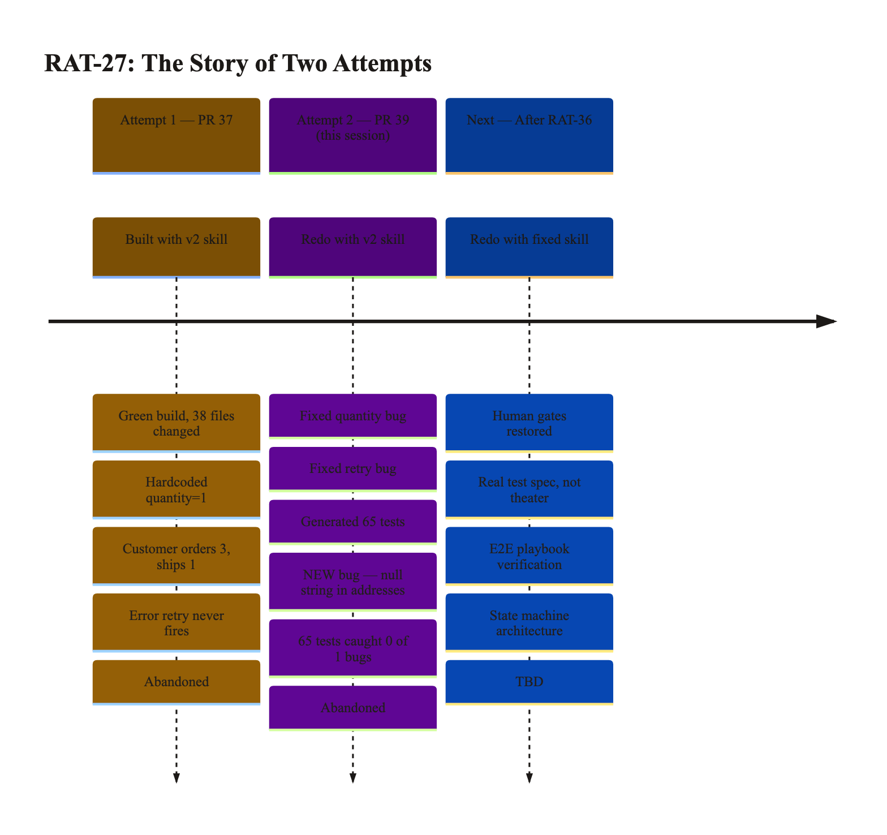
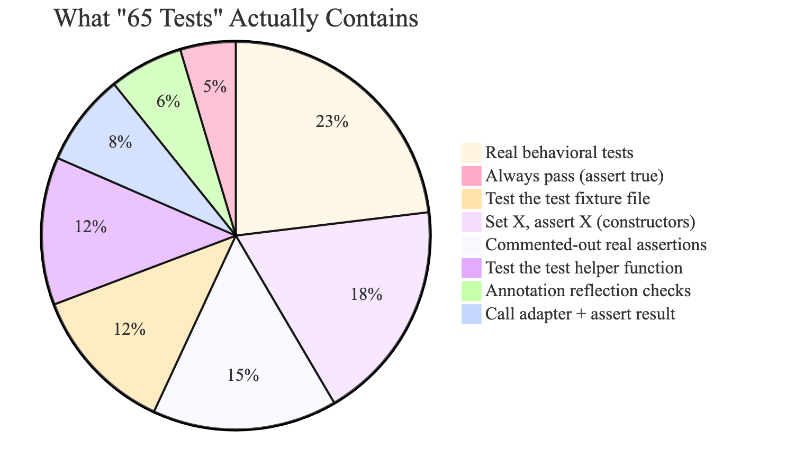
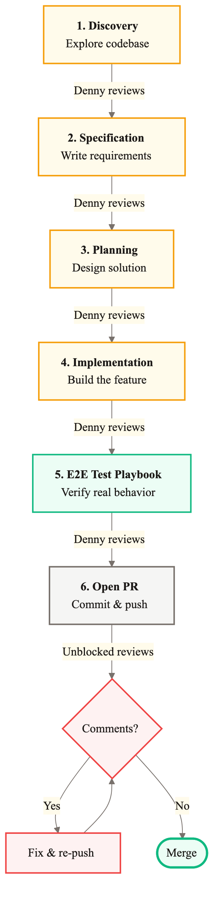
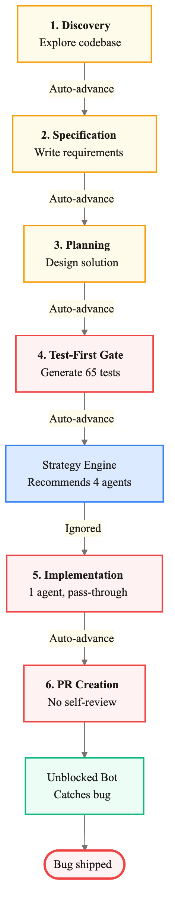
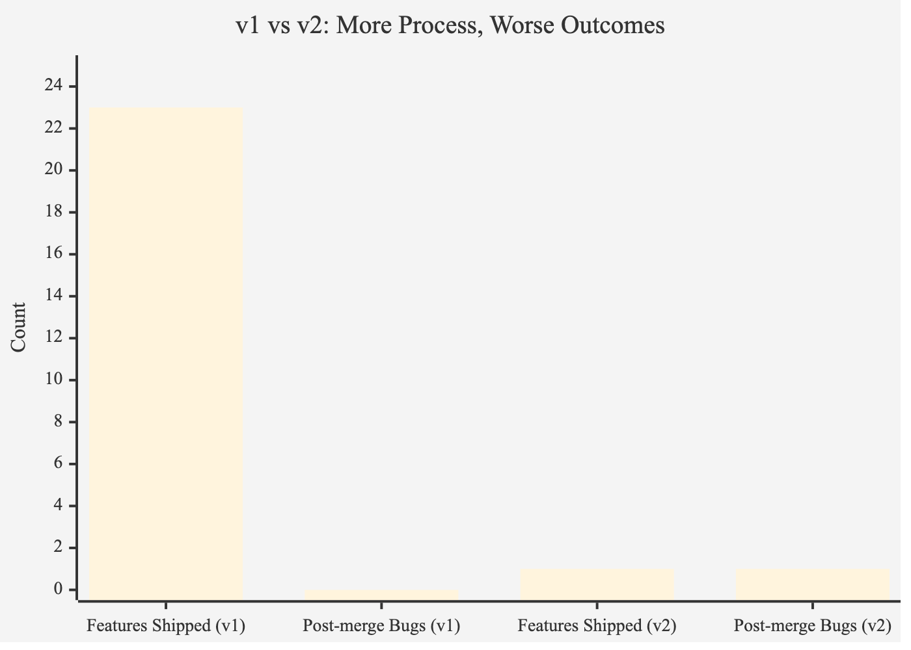
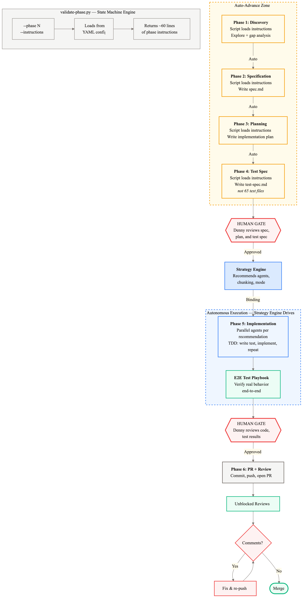

# NR-006: The Automation Paradox — Why Our Simpler Workflow Outperforms the Structured One

**Date:** 2026-03-27
**Linear:** [RAT-27](https://linear.app/ratrace/issue/RAT-27) (CJ supplier order), [RAT-36](https://linear.app/ratrace/issue/RAT-36) (skill overhaul)
**Status:** Blocked (both implementations tainted, skill overhaul needed before retry)

---

## TL;DR

We ran the upgraded 6-phase development workflow (v2) on the CJ supplier order feature as a controlled evaluation. It produced a green build with 65 automated quality checks — and shipped a data integrity bug that every single one missed. Our simpler v1 workflow delivered 23 clean features with zero post-merge bugs. The uncomfortable lesson: **automating away human judgment doesn't scale quality — it removes it.** This is a step backward that gives us total clarity on how to move forward. RAT-36 is filed with the fix.

## The Story of Two Implementations

RAT-27 is simple on paper: when a customer's order is confirmed, automatically place a purchase order with CJ Dropshipping. Customer pays, supplier ships. This is where the zero-capital model becomes real.

We've now tried to build it **twice**. Both times using the v2 workflow. Both times the build was green. Both times bugs shipped.

### Attempt 1 (PR #37): The Quantity Bug

The system built the feature and it looked good — green build, tests passing, PR opened. But review caught two critical bugs:

1. **Customer orders 3, supplier ships 1.** The order data model didn't carry quantity, so the system hardcoded it to 1. Every order. A customer buying 3 units of a product would receive 1. This is a silent revenue leak — the customer paid for 3, we ordered 1 from CJ, and the difference just... evaporates.

2. **Error recovery never fires.** The system had retry logic for CJ API failures, but a coding pattern mistake meant failures were silently swallowed before the retry mechanism could see them. Transient CJ outages would result in orders that simply vanish.

Both bugs were caught in review. Decision: start over.

### Attempt 2 (PR #39, this session): The Null String Bug

The redo was specifically designed to prevent those two bugs. And it did — the quantity flows correctly, the retry mechanism works. But a *new* bug emerged:

When a Shopify customer has no phone number on file, the system sends the literal text `"null"` to CJ's API instead of leaving the field empty. Same for province, city, and 7 other address fields. CJ would receive a shipping address like:

> **John Doe**
> **123 Main St**
> **null, null 90210**
> **Phone: null**

The irony: the existing code in the same file had a warning comment and a working guard pattern for exactly this issue, five lines above where the new code was added. The system read the file and still didn't apply the pattern consistently.

This bug was caught by the Unblocked automated reviewer — not by any of the 65 tests the workflow generated.

**Both implementations are now abandoned.** RAT-27 stays open for a third attempt after we fix the workflow itself.

## The 65-Test Illusion

Here's where it gets interesting. The v2 workflow includes a phase called "Test-First Gate" that generates automated quality checks *before* any code is written. The theory is sound: define what correct looks like first, then build to match.

In practice, the system generated 65 "tests." That number sounds thorough. It's not.

To understand why, think of it like a home inspection. A thorough inspection checks the plumbing, electrical, foundation, roof. What the system produced was more like:

- **3 inspections** that write "PASS" on the clipboard without looking at the house
- **8 inspections** that verify the blueprint exists (not that the house matches it)
- **12 inspections** that confirm the front door is the color it was painted (setting a field to "red" and checking that it says "red")
- **10 inspections** that say "Phase 5 will check this" — and Phase 5 never did
- **~15 inspections** that actually test something real (plumbing pressure, outlet voltage)

Only ~23% of the tests exercise real system behavior. The rest are theater.

And the one thing that actually broke — how the system handles empty customer data — wasn't inspected at all. Not one of the 65 tests used a customer profile with a missing phone number.

**Test count is a vanity metric. What matters is what the tests actually verify.**

## Why the Simple Approach Wins

This is the finding that matters most strategically. Our v1 workflow — the one Denny has been using since FR-001 — is simpler, faster, and has a perfect track record across 23 features.

v1 is 7 steps. Denny triggers each phase, reads the output, checks assumptions against organizational knowledge (Unblocked), runs the end-to-end test playbook, and manages the PR. It's human-in-the-loop at every boundary.

v2 added two new phases, parallel execution, a strategy recommendation engine, and **auto-advance between phases**. On paper, more structured. In practice, it automated away the one thing that actually catches bugs: Denny reading the output and applying judgment.

The numbers are stark:

| | v1 (simple, human-gated) | v2 (complex, auto-advance) |
|---|---|---|
| Features shipped | 23 | 1 (tainted) |
| Post-merge bugs | 0 | 1 (caught by reviewer, not tests) |
| Avg time per feature | ~35 min | ~48 min |
| Test theater ratio | 0% (E2E playbook tests real behavior) | ~31% (20 of 65 tests are empty shells) |
| Strategy engine followed | Yes (agents matched recommendations) | No (4 agents recommended, 1 used) |

v2 is slower AND worse. The "automation premium" is negative.

### The philosophical bit

There's a principle at work here that's worth naming: **you can automate execution, but you can't automate taste.**

The system can follow instructions, check permissions, validate deliverables, and generate artifacts. What it can't do is look at a test file that says `assert(true)` and think, "this is garbage." It can't notice that lines 69-81 don't follow the pattern established on lines 30-31 of the same file. It can't feel the difference between a test that verifies behavior and one that verifies its own test data.

Denny catches these in a 30-second scan. The v2 workflow removed that scan from the process and replaced it with... more process. More phases, more scripts, more validation — none of which validate the thing that matters: *is this actually good?*

The lesson isn't "don't automate." The lesson is "automate the things that don't require judgment, and keep the human where judgment is needed." That's what RAT-36 implements.

## The Strategy Engine That Nobody Listened To

The v2 workflow includes a strategy recommendation engine — a tool that analyzes the task and recommends how to execute it. For this feature, it recommended:

- **4 parallel workers** instead of 1
- **"Be careful" mode** (deliberative, step-by-step)
- **Batch the work** into chunks of 12 tasks across 4 groups

The system overrode all of this. It used 1 worker in "get it done fast" mode. The reasoning? "The tasks are too interconnected for parallelism." Except the engine had already accounted for that — it measured the interconnection at 0.39 out of 1.0 (moderate), and the previous session proved 3 parallel workers handle that level just fine.

The engine itself is sound: all 8 test scenarios pass, all 11 unit tests pass. The tool works. The enforcement is missing. It's like having a financial model that correctly predicts margin compression, but nobody reads the output.

## Nathan's Questions — With Data

You asked four questions in NR-005 about how the v2 workflow handles risk. This session provides concrete answers.

### A. Where did the system make assumptions, and how were they validated?

Four assumptions went unchallenged:

1. **"65 tests = coverage."** The system accepted the count at face value. A 30-second review would have revealed empty assertions. *Validation mechanism that would have caught it: the human gate.*

2. **"The code follows the patterns in the same file."** The existing code warns "guard against null values" with a working example. The new code 5 lines below ignores it. *The system read the file and didn't generalize from it.*

3. **"The strategy engine's coupling estimate is wrong."** The system overrode a quantitative analysis (0.39 coupling) with a qualitative hunch ("too coupled"). The previous session proved the analysis was correct. *Nobody checked.*

4. **"Compilable tests are meaningful tests."** Phase 4 tests compiled, which was treated as validation. But they compiled because they tested fixture files and constructors, not production behavior. *"Compilable" and "meaningful" are different things.*

### B. Under what conditions would this workflow pause or escalate?

**Honest answer: never.** Auto-advance means zero self-regulation. The validation script checks whether you *can* do something (permissions), not whether you *should* (quality). The strategy engine says "be careful" but can't enforce it.

Zero pauses occurred. The only interruption was Denny accidentally clicking the wrong button.

In v1, the workflow pauses at *every* phase boundary because Denny explicitly triggers the next step. That's the self-regulation mechanism — a human who decides "this is good enough to proceed." And it works.

### C. How does Unblocked influence decisions when prior context is incomplete?

Unblocked's strongest contribution was at the **review stage** — catching the null-string bug by comparing the actual code diff against existing codebase patterns. This is where organizational knowledge shines: the reviewer sees the working pattern and the inconsistency in one view.

During planning, Unblocked surfaced the prior attempt's two known bugs. Both were correctly prevented in the redo. But this created **tunnel vision**: the system focused on preventing known bugs while missing a novel one in the same file. Prior context wasn't wrong — it was incomplete. It highlighted specific failures without surfacing the general principle.

**Takeaway:** Unblocked is most valuable as a reviewer (checking diffs against patterns), less valuable as a planner (seeding specific bugs to watch for). You can't solve all future problems by listing all past ones.

### D. What failure scenario would this architecture handle poorly today?

**Multi-supplier orchestration.** A feature that coordinates CJ (order placement) + Shopify (fulfillment update) + Stripe (payment capture) in one flow. Each service handles empty data, errors, and retries differently.

The workflow would generate happy-path test placeholders for each service in isolation. No test would exercise the full chain. A missing phone number from CJ could cascade: CJ order succeeds with `"null"` phone → Shopify fulfillment update sends the literal string → Stripe webhook fails to match the customer → payment captured for a broken order.

For our zero-capital model where every order is funded by customer payment: broken fulfillment = refund + lost margin + customer trust. The cost of one bad shipment far exceeds the cost of a human reviewing the test plan.

The fix (RAT-36) addresses this: a test *specification* that defines cross-service boundary cases before implementation, mandatory end-to-end verification after implementation, and a human gate where Denny says "this touches 3 services, I want to see null handling for each."

## Status Snapshot

| Area | Status | Notes |
|---|---|---|
| CJ supplier order (RAT-27) | **Blocked** | Both PRs tainted — redo after skill overhaul |
| Skill evaluation | **Done** | PM-017 root cause analysis + this report |
| Workflow overhaul (RAT-36) | **Not Started** | High priority — state machine refactor |
| Shopify webhook (RAT-26) | **Done** | Prerequisite for RAT-27, unaffected |
| Tracking ingestion (RAT-28) | **Blocked** | Blocked by RAT-27 |

## What's Next: The Proposed Architecture

The fix isn't "go back to v1." It's take the best of both — v1's human judgment, v2's structured artifacts and parallel execution — and wire them together with a state machine that makes it structurally hard to skip steps.

The key design decisions:

- **Phases 1-4 auto-advance** (low-risk, read-heavy — spec, plan, test spec). No human interruption needed.
- **Human gate before implementation** (Phase 5). Denny reviews the spec, plan, and test specification. This is where "is this actually good?" gets answered.
- **Strategy engine is binding**, not advisory. If it says 4 parallel workers, you use 4. Override requires written justification.
- **Phase 4 produces a test *specification***, not 65 test files. It defines what to test (including boundary cases like null data) and which end-to-end scenarios to add. No more `assert(true)`.
- **E2E test playbook runs after implementation**, not placeholder tests before it. Test real behavior, not imagined behavior.
- **Human gate before PR**. Denny reviews the actual code and test results.
- **The state machine engine** (bottom-left) loads each phase's instructions dynamically from a configuration file. Each phase gets ~60 lines of fresh, specific instructions — not a lossy summary of an 800-line document. Like a vending machine that can't dispense without payment: the structure prevents the error, not willpower.

### Sequenced work

- **RAT-36: Workflow overhaul** — Build the state machine architecture above. This is the infrastructure that makes everything else reliable.

- **RAT-27 redo** — Third attempt at CJ supplier order, this time with the fixed workflow. This is the validation: if it produces a clean implementation on the first try, the overhaul worked.

- **RAT-28: Tracking ingestion** — Remains blocked by RAT-27. Sequence: fix workflow → redo CJ order → tracking.

## Risks & Decisions Needed

- **Close both RAT-27 branches?** Two implementation PRs exist (PR #37 and PR #39). Both are tainted — different bugs, same root cause (workflow gaps). **Ask:** Approve closing both. RAT-27 stays open for the third attempt.

- **Human review adds ~2 min per feature.** The overhaul restores human checkpoints at two points: before implementation starts and before the PR is created. This adds a small time cost per feature. **Ask:** Confirm this tradeoff — speed for quality — aligns with the zero-capital model's zero tolerance for fulfillment errors. (I think we both know the answer, but it's worth stating explicitly.)

## Session Notes

- The strategy engine is a solid tool — all scenarios pass, it just needs enforcement, not redesign. Think of it like a financial model that's accurate but optional to read.
- The state machine architecture for the workflow is elegant: each phase's instructions load dynamically from a configuration file, making it structurally impossible for the agent to "forget" rules. Like how a vending machine can't dispense without payment — the structure prevents the error, not willpower.
- The CJ order implementation itself is architecturally sound (event-driven, correct transaction patterns, proper retry configuration). The bugs are at data boundaries, not in the design. This means the redo should be faster — we're validating execution quality, not re-designing.
- Total session compute: 6 phases in ~48 min, 53 files changed, +3,762 lines. Most of the value came from the last 20 minutes — the postmortem and this analysis.
