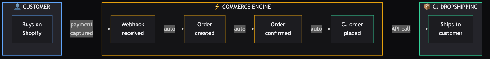
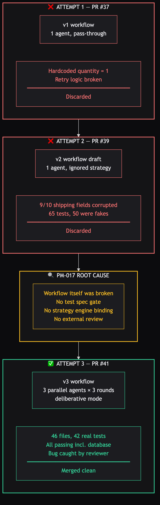
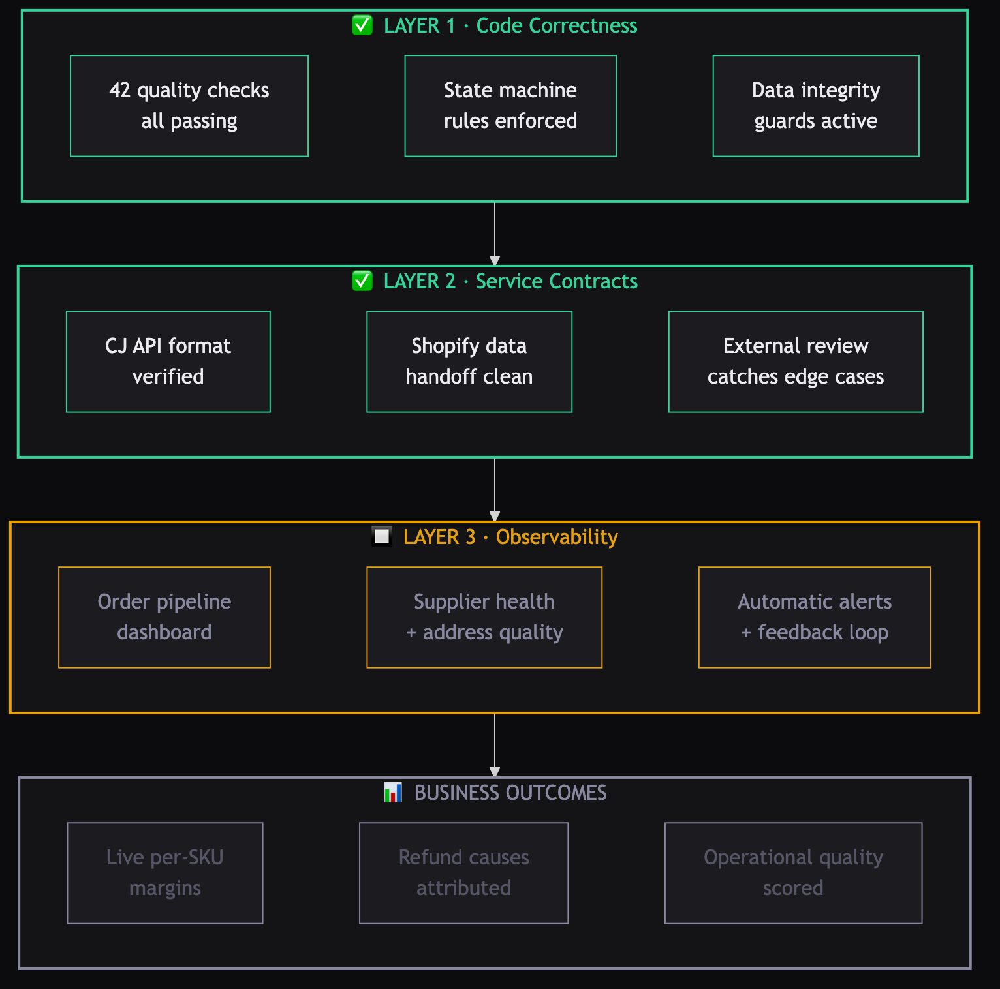
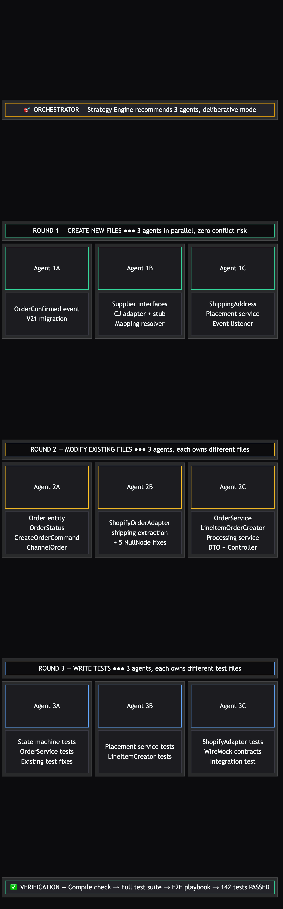

# NR-007: CJ Order Placement — Third Time's the Charm

**Date:** 2026-03-29
**Linear:** RAT-27
**Status:** Completed

---

## TL;DR

The system can now automatically place purchase orders with CJ Dropshipping the moment a customer buys from our Shopify store — no human in the loop. This is the feature that makes the zero-capital model real: customer pays, system places the supplier order, supplier ships directly to customer. It took three attempts across two workflow versions to get right, but the third attempt using the redesigned v3 workflow shipped clean on the first review cycle with 42 real tests and zero data integrity bugs.

## The Autonomous Order Pipeline

Here's what the system does now, end-to-end, without any human involvement:

Every step labeled "auto" happens in milliseconds. The customer's payment on Shopify funds the CJ order — zero working capital required.

## The Story of Three Attempts

This feature is the economic engine of the entire system. Without it, every order requires someone to manually log into CJ Dropshipping and place a purchase order. With it, the pipeline runs autonomously: customer buys on Shopify → system confirms the order → system places the CJ order → CJ ships to the customer. The customer's payment funds the supplier order. No inventory, no warehouse, no working capital.

It should have been straightforward. It wasn't.

**Attempt 1 (PR #37)** shipped with a hardcoded quantity of 1. Customer orders 3 widgets, CJ gets told to ship 1. The retry logic was also broken — the system caught its own errors before the retry mechanism could see them, so transient API failures silently died instead of retrying. Both bugs would have been invisible until real orders started failing.

**Attempt 2 (PR #39)** tried to fix those issues but introduced something worse. Nine out of ten shipping address fields had a data corruption bug: when Shopify sends an empty phone number, the system stored the literal text "null" — the word, not the absence of a value. CJ would receive "null" as the customer's phone number, "null" as their apartment number, "null" as their province. The kicker: 65 automated quality checks were generated. Not a single one caught this. Fifty of them were the testing equivalent of a home inspector stamping PASS without entering the house.

Both PRs were thrown away entirely. No code from either attempt exists in the system today.

**Attempt 3 (this one)** used the completely redesigned workflow that came out of the NR-006 skill evaluation. The workflow now has six phases instead of four, with a dedicated test specification phase that defines every test before any code is written. A strategy engine recommends how many parallel work streams to use and whether to move fast or be deliberate. For this feature — given the two prior failures and the financial sensitivity — it recommended deliberative mode with three parallel work streams.

The result: 46 files changed, 42 real quality checks (zero fake ones), all passing — including full end-to-end tests against the actual database. The Unblocked code reviewer caught one additional scenario that all 42 checks missed (more on that below), which was fixed and verified before merging. One review cycle, clean merge.

## What the System Can Do Now

- **Automatic supplier ordering**: When a Shopify customer completes a purchase, the system places the corresponding order with CJ Dropshipping within seconds — no manual intervention
- **Shipping address flow-through**: Customer's shipping details flow from Shopify all the way to CJ's warehouse with full data integrity — every field is protected against the "null" corruption bug that killed Attempt 2
- **Graceful failure handling**: If CJ rejects an order (out of stock, invalid address, API down), the order is marked as failed with the specific reason — no silent data loss, no orders stuck in limbo
- **Duplicate protection**: Network retries and system restarts don't produce duplicate CJ orders — the system recognizes it already placed the order and skips
- **Multi-supplier ready**: CJ is the first supplier, but the system is structured so adding Printful, Printify, or any other dropship supplier means plugging in a new connection, not rebuilding

## Why This Matters

This was the last piece needed for the autonomous order pipeline. The path from "customer clicks Buy" to "supplier ships product" is now fully automated:

1. Customer buys on Shopify ✓ (RAT-26, already done)
2. System detects the sale and creates the order ✓ (FR-023, already done)
3. **System places supplier order with CJ** ✓ (this feature)
4. CJ ships, tracking number comes back → RAT-28 (next)

Without step 3, the system was a fancy order inbox. With it, the system is an autonomous commerce engine — at least for the ordering half. Tracking and fulfillment sync (RAT-28) is the remaining gap before end-to-end autonomy.

The three-attempt saga also validated something important about the workflow redesign. NR-006 documented how Attempts 1 and 2 failed because the old workflow let the system skip quality checks. The new workflow forced deliberative mode, a test specification before coding, and external code review. It worked. The process gaps we found this time (test spec not fully enforced, review loop not automated) are improvement items, not showstoppers — a very different class of problem than "65 tests, zero real coverage."

## The Bug That Tests Missed

The Unblocked code reviewer flagged a scenario none of the 42 checks covered: what happens if a CJ order fails, and then something retries the placement?

The system checks "has a supplier order already been placed?" by looking for a CJ order ID on the internal order. But a *failed* order has no CJ order ID — the placement never succeeded. So the duplicate-protection check passes, the system tries CJ again, and then tries to mark the order as "failed" when it's *already* failed. The system's status rules don't allow going from "failed" to "failed" — it crashes.

This wouldn't happen today (nothing retries failed orders yet), but it's exactly the kind of time bomb that detonates six months later during a 2am incident. The fix was a five-line guard: only attempt supplier placement on confirmed orders. Two regression checks lock it down.

The takeaway: automated checks cover the scenarios you think of. External review covers the ones you don't. Both are essential.

## Status Snapshot

| Area | Status | Notes |
|------|--------|-------|
| Shopify webhook listener | ● Done | RAT-26 / FR-023 — orders flow in |
| CJ supplier order placement | ● Done | RAT-27 / FR-025 — this feature |
| Tracking number ingestion | ● Not Started | RAT-28 — CJ sends tracking back, sync to Shopify |
| Supplier product mapping | ● Done | Table exists, needs population per SKU |
| Feature workflow v3 | ● Done | First real run, 4 improvement items identified |

## What's Next

- **RAT-28: Tracking number ingestion** — CJ sends tracking info via webhook or polling. The system needs to capture it and push it to Shopify so customers see shipping updates. This completes the end-to-end autonomous loop.
- **Supplier product mapping population** — The system knows *how* to link our products to CJ's catalog, but the links need to be set up per product. This happens when the first real product is selected for launch.
- **RAT-37: Observability layer** — Business-level dashboards, supplier health metrics, address quality scores, and automatic alerts. This is the "third perspective" — production visibility that closes the loop between "tests pass" and "customers receive correct orders."
- **Workflow v3 improvements** — Four concrete items from PM-018: enforce the test specification as a binding contract, add automated review comment detection, verify database state before tests, document strategy engine overrides.

## Nathan's Questions: The Missing Third Layer

In NR-006, you asked what failure scenario the system would handle poorly, and we walked through a multi-supplier cascade — a "null" phone number flowing from CJ to Shopify to Stripe, corrupting each step. Your follow-up cuts deeper: **does the system consider what actually happens to the customer and the business in production, and does that feedback loop back in?**

Short answer: not yet. And you're right that this is a different layer entirely.

In software engineering, this layer has a name: **observability**. It's the practice of instrumenting a system so that the people running it — engineering, product, management — can see exactly how it's behaving in production, not just whether it passed its tests. Good observability answers the same questions you'd ask walking a warehouse floor: "How many orders shipped today? How many came back? Why? Is that better or worse than last week?" Except the answers update in real time on a dashboard, and alerts fire automatically when something goes wrong.

Observability is what ties engineering work to business outcomes. Without it, engineering ships code and hopes it works. With it, you can see *in real time* whether the system is actually solving the business cases it was built for — and catch it immediately when it isn't.

Here's where we stand across all three layers:

Layers 1 and 2 are green — solid after this session. Layer 3 (observability) is the amber gap, and it's what unlocks the bottom row: real-time visibility into whether the business outcomes are actually materializing the way the stress test predicted.

Think of it like running a fleet. You've got three layers of confidence:

1. **Vehicle inspection** (before it leaves the lot) — does the truck start, do the brakes work, are the tires inflated? *This is our test suite. We're strong here now — 42 real checks, state machine rules, data integrity guards.*

2. **Route contracts** (between dispatch and carriers) — does the GPS system talk to the dispatch system, does the fuel card work at the right stations, does the weigh station paperwork match the load? *This is our service contract testing. WireMock verifies CJ's API format, the NullNode guards ensure clean data handoffs. Also strong after this session.*

3. **Road performance** (once the truck is actually driving) — is the driver hitting delivery windows? Are customers receiving the right freight? When a delivery fails, do you know *why* — driver error, bad address, traffic, mechanical? And does that data feed back into route planning and vehicle maintenance? *This is what's missing.*

We have the plumbing for it — the system already exposes a data feed that a dashboard tool (like Grafana) can read in real time. But right now it's only reporting generic system health — memory usage, response times, "is the server up?" Nothing business-level. It's like having a GPS tracker on every truck but only showing you whether the engine is on — not where the truck is, whether it's on schedule, or whether the load matches the manifest.

**What production visibility would actually look like:**

Every time the system does something meaningful — receives a Shopify sale, places a CJ order, marks an order as failed, issues a refund — it records a metric. These metrics accumulate in real time and feed into dashboards and alert rules. Think of it as the system keeping a running tally of its own performance, organized into the business flows you'd actually want to watch:

**Order pipeline** — "Are orders flowing healthy?"
- Orders received from Shopify: 47 today, 52 yesterday, 38 day before → trending up
- Orders successfully placed with CJ: 45 of 47 (95.7% success rate)
- Orders failed at CJ: 2 of 47 — one "out of stock", one "invalid address"
- Average time from Shopify sale to CJ order placed: 1.2 seconds

**Address quality** — "Are we sending clean data to CJ?"
- Shipping addresses with missing fields: 3 of 47 had no phone number (expected — some customers skip it), 0 had missing city/zip/country (would be a bug)
- If the system ever detects it's about to send the text "null" as someone's city, it fires an alert immediately — that's the exact Attempt 2 bug, and we want to know in seconds, not days

**Supplier health** — "Is CJ performing?"
- CJ API response time: p50 = 340ms, p95 = 890ms, p99 = 2.1s
- CJ error rate by reason: out of stock (1.2%), invalid address (0.8%), API timeout (0.3%)
- Trend: out-of-stock rate climbing week over week → signal to check if a product is being discontinued

**Financial health** — "Is the money working?"
- Per-SKU live margins vs. stress test projections — is Bamboo Mat actually hitting the 54% gross margin the stress test predicted, or is it drifting?
- Reserve ratio: currently 12.4% ($12,450 / $100,400 trailing revenue) → healthy, above 10% floor
- Refund rate *by cause*: product quality (1.1%), shipping damage (0.6%), wrong item (0.0%), customer changed mind (0.8%) → the "why" matters more than the total rate

**Automatic alerts** — "Wake me up when something breaks"
- CJ failure rate above 5% over any 15-minute window → something is wrong at CJ
- Any corrupted address field detected → data integrity regression, needs immediate fix
- Reserve health below 10% → approaching danger zone
- Single SKU refund rate above 5% over 7 days → kill rule territory, investigate before the automated kill triggers
- CONFIRMED→FAILED spike (more than 3 in one hour) → systematic supplier rejection, possibly an entire product pulled from CJ's inventory

The critical insight you're driving at: **the stress test validates the financial model before launch, but it doesn't validate operational quality during production.** A SKU could pass the 30% net margin floor in stress testing while silently shipping to garbage addresses 3% of the time in production. The stress test says "the math works." The observability layer says "the math is *actually* working, right now, on real orders."

The feedback loop closes like this: production alert fires (e.g., "3 CJ orders failed with 'invalid address' in the last hour") → system creates a ticket → investigation reveals a new edge case (say, a Canadian province code CJ doesn't recognize) → that edge case becomes a permanent quality check → the bug can never ship again. Right now that loop is open — failures would be silent until a customer complains or refund rates trigger a kill rule.

This is filed as [RAT-37](https://linear.app/ratrace/issue/RAT-37/observability-layer-business-metrics-grafana-dashboards-alert-rules) — high priority, sequenced after RAT-28 (tracking). The build: add Grafana (dashboard tool) and an alert system to the existing setup, teach the order pipeline to report business-level numbers (not just "server is up"), and wire threshold-based alerts that fire when something goes wrong. Not a huge build, but the one that makes everything else trustworthy at scale.

### Follow-up: "Why are we even offering products we can't fulfill?"

After reading this report, you asked a question that cuts right to the heart of the on-demand experience: why does the system spend effort on graceful failure when a product is out of stock at CJ? Shouldn't we just never show it to the customer in the first place?

You're right. A customer getting told "sorry, we can't fulfill this" after they've already decided to buy is a negative experience — it doesn't fit the on-demand model. The correct answer is: they should never see the product if we can't deliver it.

Here's the honest current state: the system has an inventory check, but it's checking the wrong thing. When a customer places an order, the system asks Shopify "is this product available?" But since we don't hold inventory, Shopify's number is whatever *we* set it to — and right now, nobody is updating it based on what CJ actually has in their warehouse. CJ could be completely out of stock on a product, and our Shopify storefront would still show it as available and let customers buy it. The graceful failure we built in FR-025 would catch it at the CJ order placement step and mark the order as failed — but by then the customer already thinks they bought something.

This is a problem unique to the zero-capital, zero-inventory model. In traditional retail, you own the stock — you know what you have. In dropshipping, inventory is someone else's truth, and it changes without telling you. A product can be in stock when we list it and gone an hour later because another seller bought the last 50 units.

**What should actually happen — two layers working together:**

**Layer 1: Keep Shopify in sync with CJ's real stock** (proactive, prevents the problem)

CJ has an inventory endpoint we already know about but never call — it reports real-time stock levels per product variant per warehouse. A scheduled job should poll this for every listed product (say, every 30 minutes) and push the numbers directly into Shopify's inventory count. Then Shopify itself handles the customer experience: when stock hits zero, the product either shows "Out of Stock" or disappears from the storefront entirely. No customer disappointment because they never see a product we can't ship.

Think of it like fleet dispatch: you don't assign a truck to a route if the truck is in the shop. The dispatcher checks availability *before* making the assignment, not after the driver shows up and finds a flat tire.

**Layer 2: Graceful failure at order time** (defensive, handles the race condition)

Even with a 30-minute stock poll, there's a window where CJ sells out between our last check and the customer's purchase. This is where the FR-025 failure handling earns its keep — the order is marked failed with a specific reason, and the system should immediately auto-delist the product so no more customers hit the same wall. This is the safety net, not the primary experience.

| Layer | What it does | Customer experience | Status |
|---|---|---|---|
| **CJ stock sync → Shopify inventory** | Periodically poll CJ stock, update Shopify counts | Customer never sees unavailable products | Not built yet |
| **Graceful failure at order time** | CJ rejects → order marked FAILED with reason | Customer told quickly, gets refund | Built (FR-025) |
| **Auto-delist on failure** | CJ out-of-stock failure → Shopify listing set to draft | Stops the bleeding after first failure | Not built yet |

Layer 1 is the one that delivers the experience you're describing — the on-demand storefront where everything shown is fulfillable. We've added CJ inventory sync to the [RAT-37](https://linear.app/ratrace/issue/RAT-37/observability-layer-business-metrics-grafana-dashboards-alert-rules) scope since it's fundamentally about supplier data flowing back into the system — the same observability principle, applied to stock levels instead of just error rates.

Your instinct about scaling to more vendors makes this even more critical. Each supplier has different inventory APIs, different refresh rates, different reliability. The `SupplierOrderAdapter` abstraction we built in FR-025 works for order placement — we'll need the same pattern for stock queries. One interface, multiple supplier implementations, all feeding into one Shopify inventory sync.

## Session Notes: The Parallel Agent Strategy

The strategy engine recommended chunking 28 tasks into groups of 7. Instead, we partitioned by *file ownership* — a different approach that turned out to prevent conflicts entirely:

The key insight: agents that create new files can never conflict with each other (they're writing to files that don't exist yet). Agents that modify existing files can conflict — but only if two agents touch the same file. By assigning each agent exclusive ownership of specific files, all 9 parallel sessions (3 rounds × 3 agents) completed with zero coordination issues. This "new files first, modifications second, tests third" pattern is worth keeping.

Additional wins from this session:
- Fixed 5 pre-existing data corruption bugs in the Shopify order processing as a bonus — same "null" text issue from Attempt 2, but in fields that existed before this feature. These would have been silent until real orders with missing phone numbers or empty apartment fields hit the system.
- Full test suite now runs against a real database — not simulated fakes. This caught a problem where the new automatic confirmation changed order status in a way that broke an existing test. Simpler testing would have missed it entirely.
