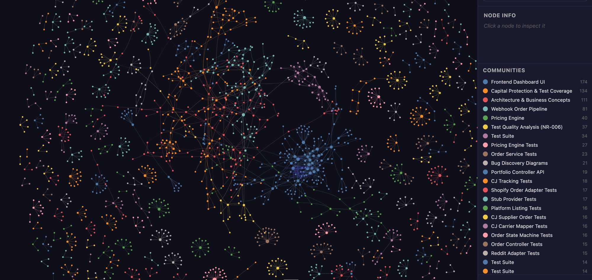

# NR-009: Road to First Dollar — Pipeline Complete, 4 Tickets to Live Test

**Date:** 2026-04-08
**Linear:** RAT-42, RAT-43, RAT-44, RAT-45, RAT-46
**Status:** In Progress

---

## TL;DR

We mapped the entire system against one question: *what is stopping us from making money?* The answer surprised us. The autonomous order pipeline is code-complete — every step from product discovery to reserve credit is built, tested, and connected. What's missing isn't engineering, it's operations: deploying with real API keys, registering webhooks with Shopify and CJ, handling refunds, and being able to see what's happening. Four tickets stand between us and a live test where I buy a product from our store and it ships to my house. Four more after that to serve real customers.

## The Story of the Audit

We installed a new knowledge graph tool (graphify) that maps the entire codebase, documentation, feature requests, and postmortems into a queryable graph of concepts and relationships. Think of it like a GPS for the codebase — instead of reading files one at a time, we can ask "what connects the order pipeline to the capital module?" and get the actual structural answer.

Here's what the graph looks like — every dot is a concept (a service, a domain event, a business rule, a test), and every line is a relationship. The clusters are communities that the algorithm detected automatically:

You can see the Webhook Order Pipeline cluster (teal), Capital Protection & Test Coverage (orange), Architecture & Business Concepts (red), and the Frontend Dashboard (blue) as distinct neighborhoods. The connections *between* clusters are where the interesting insights live — that's how we traced the AFTER_COMMIT annotation pattern from a Spring technical detail all the way to the zero-capital business model in 3 hops.

We used the graph alongside Unblocked (which searches our PRs, commits, and Linear history) to cross-validate findings. This turned up two things that would have burned time later:

1. **The implementation roadmap is stale.** It still shows the cost gate and stress test as "Planned" — they've been complete since March. Anyone reading that document as a source of truth would think we're further behind than we are.

2. **Unblocked initially said the tracking webhook was unbuilt** — because it was looking at `main` where the PR hadn't merged yet. The knowledge graph, which indexes the actual working branch, showed all the tests and implementation. We caught the discrepancy in minutes instead of re-implementing something that already exists.

The real finding: **the code pipeline is done.** The system can discover products, list them on Shopify, receive orders, place them with CJ, receive tracking, push it to Shopify so the customer gets a shipping email, detect delivery, and credit the reserve. Every link in the chain is built and tested.

## What's Actually Blocking Us

Three categories of work, in order of urgency:

### Critical Path — First Live Test (this week)

| # | Ticket | What | Why |
|---|--------|------|-----|
| 1 | RAT-45 | Filter CJ product catalog to US warehouses only (Chino, CA and New Jersey) | Products from US warehouses ship in 2-5 days instead of 2-3 weeks from China. Lower shipping costs, better stress test margins, simpler customs. For our first test, we want a product that actually arrives. |
| 2 | RAT-42 | Deploy the app publicly, configure real API keys, register webhooks | Shopify and CJ need to reach our system to send order and tracking webhooks. Right now the app only runs locally with fake data. |
| 3 | RAT-43 | Handle Shopify refund webhooks | When we return the test product, the system needs to know about it — update the order status, adjust the reserve, and feed the refund rate calculations that trigger kill rules. The data model for this is 80% built (return records, refund flags on capital records, refund rate breach detection). The missing piece is the webhook listener. |
| 4 | RAT-44 | Structured logging and basic monitoring | We need to see what's happening when real money flows through. Correlation IDs across the order chain, alerts for failed supplier placements, stuck order detection. Flying blind on a live test is how you lose money and don't know why. |

### Production Readiness — Serving Real Customers

| # | Ticket | What | Why |
|---|--------|------|-----|
| 5 | RAT-38 | Kill rule refinement — don't kill idle products | Current kill rules would terminate products that aren't selling yet. In our zero-inventory model, an idle listing costs nothing — it's a free lottery ticket on the shelf. Kill rules should only fire on products that are actively losing money (high refund rate, negative margin). |
| 6 | RAT-39 | CJ inventory sync — check stock before selling | Prevents selling products CJ has run out of. Fine to skip for 1-5 test products. Critical before scaling to dozens. |
| 7 | RAT-14 | Automated marketing and SEO | No traffic, no sales. For the live test I'll buy the product myself. For real revenue, customers need to find the store. This is the largest remaining gap — it's an entire new capability, not a missing integration. |
| 8 | RAT-46 | Revenue reconciliation — match actual Shopify payouts to our internal records | The capital module estimates margin from the cost envelope. Shopify Payments tells us what actually happened — real fees, real payouts, real profit/loss per SKU. Needed before we trust the system to make scale/kill decisions with real money. |

### Not Critical — Scaling Later

| Ticket | What | When it matters |
|--------|------|----------------|
| RAT-16 | More demand signal sources (GA4, sentiment analysis, semantic dedup) | 4 sources work fine for launch |
| RAT-40 | Multiple Shopify stores with cross-store dedup | Nathan's scaling vision. Irrelevant until one store is profitable |
| RAT-25 | Machine-readable user journey maps for agentic planning | Developer tooling. Doesn't affect whether the product works |

## The CJ US Warehouse Angle

This one came from deep research and deserves a callout. CJ operates two US-based warehouses — Chino, California and one in New Jersey. Products sourced from these warehouses have fundamentally different economics:

| | China Warehouse | US Warehouse |
|---|---|---|
| Shipping time | 7-20 days | 2-5 days |
| Shipping cost | Higher (international) | Lower (domestic) |
| Customs/duties | Yes | No |
| Refund risk | Higher (long delivery = impatient customers) | Lower |
| Stress test margins | Tighter | More headroom |

For Phase 1, we should exclusively source from US warehouses. The catalog is smaller, but every product in it ships fast, costs less to deliver, and clears the stress test more easily. This is the "prove the model works" phase — we want reliability, not breadth.

RAT-45 scopes this: filter the demand scan to US warehouse products, store warehouse metadata in our supplier mappings, and verify CJ orders route domestically.

## Why This Matters

NR-008 ended with: *"The business loop is closed."*

That's still true — the code pipeline handles every step. But code and business aren't the same thing. We've been building a race car in a garage. The engine works, the brakes work, the steering works. What we haven't done is put gas in it and drive it on an actual road.

The 4 critical path tickets are the gas, the road, and the first lap. After that, RAT-14 (marketing) is how we get other people to ride in it.

## Status Snapshot

| Area | Status | Notes |
|------|--------|-------|
| Product discovery (DemandScanJob) | Done | 4 signal sources active |
| SKU lifecycle (compliance → cost gate → stress test → listed) | Done | Full state machine, all gates implemented |
| Shopify product listing | Done | Auto-creates on LISTED transition |
| Order detection (Shopify webhook) | Done | HMAC verified, deduplicated |
| Supplier order placement (CJ) | Done | Idempotent, failure handling |
| Tracking ingestion (CJ webhook) | Done | Merged this week (RAT-28) |
| Shopify fulfillment sync (customer gets tracking email) | Done | Auto-pushes on tracking received |
| Delivery detection + reserve credit | Done | Carrier polling + capital recording |
| **Refund/return handling** | **Not Started** | RAT-43 — webhook listener needed |
| **Live deployment with real APIs** | **Not Started** | RAT-42 — credentials + webhook registration |
| **US warehouse filtering** | **Not Started** | RAT-45 — scope CJ catalog to domestic |
| **Observability** | **Not Started** | RAT-44 — structured logging, alerts |
| **Marketing / SEO** | **Not Started** | RAT-14 — entire new capability |
| **Revenue reconciliation** | **Not Started** | RAT-46 — Shopify payout sync |

## What's Next

If the 4 critical path tickets land this week, the live test looks like:

1. Pick a cheap product from CJ's US warehouse catalog
2. Run it through the full pipeline — compliance, cost gate, stress test
3. It auto-lists on Shopify with real pricing
4. I buy it with a real credit card
5. CJ ships it from Chino or NJ
6. I get a Shopify shipping email with a real tracking number
7. Package arrives at my house
8. I return it through Shopify — system processes the refund
9. Capital module adjusts everything

If all 9 steps work, we've proven the model end-to-end with real money. After that, it's marketing (RAT-14) and scaling.

## Risks & Decisions Needed

- **CJ API warehouse filtering**: We need to verify that CJ's product search API actually supports filtering by warehouse country. The documentation suggests it does (`countryCode` parameter) but we haven't confirmed. If it doesn't, we'd need to fetch all products and filter client-side. **Ask:** No action needed yet — RAT-45 will investigate and adapt.

- **Shopify store setup**: The live test requires a Shopify store with Payments enabled and a custom app for API access. **Ask:** If you have preferences on the store name, niche focus, or whether to use a dev store vs. a paid plan for the test, flag them now. Otherwise I'll set up a dev store.

- **Marketing strategy (RAT-14) is the biggest unknown**: The pipeline can list and fulfill products, but nobody will see them without traffic. The ticket scopes SEO automation, content generation, and social media — but the approach (which platform first? how aggressive on auto-generated content?) needs a product conversation before implementation. **Ask:** Let's discuss marketing strategy after the live test proves the pipeline works. Pinterest has the highest organic commerce ROI — worth considering as the first channel.

## Session Notes

- The graphify knowledge graph tool proved its value immediately — it cross-referenced postmortems, feature specs, and actual code to surface the real blockers in minutes. It caught that the implementation roadmap is stale and that Unblocked was looking at the wrong branch. We installed it from a forked repo in an isolated environment for security.
- The biggest insight was reframing the question from "what's architecturally incomplete" to "what's stopping money from flowing." The first framing surfaces 6+ engineering gaps. The second reveals the pipeline is done and the blockers are operational.
- Total new tickets created: 5 (RAT-42 through RAT-46). These represent the complete remaining work between today and production revenue.
