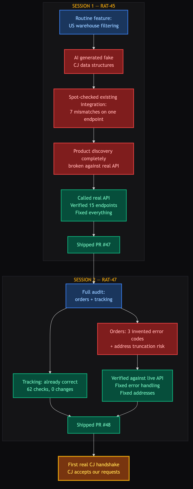
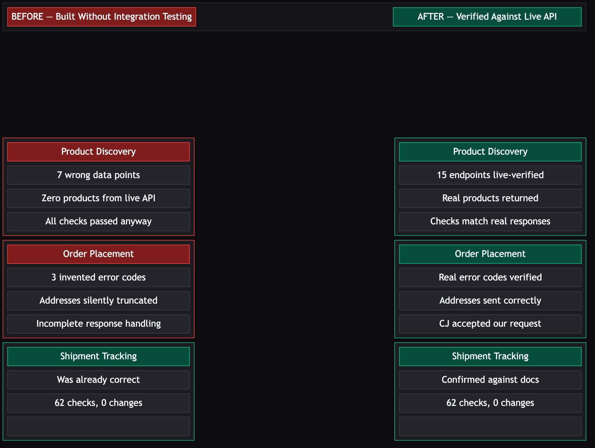

# NR-010: The CJ Integration Was Built on Fiction — Now It's Real

**Date:** 2026-04-14 (updated)
**Linear:** [RAT-45](https://linear.app/ratrace/issue/RAT-45), [RAT-47](https://linear.app/ratrace/issue/RAT-47), [RAT-42](https://linear.app/ratrace/issue/RAT-42)
**Status:** In Progress

---

## TL;DR

Our entire CJ Dropshipping integration — product discovery, order placement, shipment tracking — was never tested against the real API. Every automated check passed, but they were all validating against made-up data. We've now fixed that: CJ is accepting our requests and sending real responses back. **And as of today, the operational infrastructure to run the full pipeline with real APIs is built** — a one-command deployment, complete credentials documentation, and a 550-line step-by-step runbook to execute the live test. Three PRs shipped (#47, #48, #49). The gap to a real order is now just credentials and a button press.

## The Bigger Lesson

Here's the thing: on any traditional engineering team, this wouldn't have happened. When you integrate with a supplier API, you stand up a test environment, hit the real endpoints, and verify the responses match what your code expects. Integration testing. It's standard practice — not because engineers are paranoid, but because documentation drifts, APIs change, and assumptions compound.

We skipped that gate. The AI-accelerated workflow made it easy to skip — it generated plausible-looking test data, the automated checks passed, and everything looked green. The speed was real, but we blew past a discipline gate that exists for a reason.

**The takeaway isn't "don't use AI for development." It's "AI makes you fast, but fast without the same engineering discipline gates that already exist in good teams just means you build the wrong thing faster."** Integration testing, live API verification, contract validation — these practices exist because they catch exactly this class of problem. We need them in our workflow regardless of whether a human or an AI wrote the code.

## The Story

### Act 1: A Routine Feature Exposes the Gap

RAT-45 was straightforward — filter CJ product discovery to US warehouses. Faster domestic shipping, no customs duties, better stress test pass rates. During scoping, the AI described CJ's product data as containing a structured warehouse list with location codes. The spec, plan, and test scenarios were all built around that structure.

**It doesn't exist.** CJ returns a simple inventory count. Denny caught it by pulling up the actual CJ documentation before any code was written. Everything downstream was thrown out and redone.

### Act 2: If One Thing Was Wrong, What Else Was?

After fixing the warehouse feature, we did what should have been done from day one: called the real CJ API.

**Seven mismatches on a single response.** Product IDs, names, prices, images, categories, even where products sit in the response — all wrong. Against the live API, our product discovery would have found **zero products**. Not an error. Not a crash. Just silence. And every automated quality check said "all clear" — because the checks were built against the same fictional data. The auditor was copying from the ledger.

We fixed product discovery and built a verified contract by calling 15 of CJ's 16 product endpoints live.

### Act 3: The Full Audit

That left orders and tracking — the money and shipments side. RAT-47.

We authenticated with CJ, called the order system, deliberately triggered errors, and pulled their webhook documentation.

**Good news:** Shipment tracking was already correct. 62 automated checks, zero changes.

**Order placement was not:**

- **Three invented error codes.** Our system expected error numbers for "out of stock" and "invalid address" that CJ has never used. Real failures would have gone unrecognized.
- **Address truncation.** CJ accepts two separate address fields. We were cramming both into one. Long addresses — apartment numbers, suite numbers — silently dropped.
- **Incomplete response handling.** CJ includes a status indicator in every response that we weren't accounting for.

### The Handshake

We sent a test order request to CJ's live system. CJ parsed it, looked up the (fake) product, and responded: "Invalid products." Not "I can't understand your request" — a proper business-level rejection. **The request format was correct. CJ understood us.** First real supplier handshake.

### Act 4: Building the Test Track

The contracts are right. CJ understands us. But the system had never run outside a developer's laptop — there was no way for Shopify or CJ to reach our application with real webhook notifications. No deployment configuration, no public URL, no runbook explaining how to wire everything together.

RAT-42 closed that gap. The system now has:

- **A one-command deployment** — one command builds the application, another brings up the full stack (database + application + optional public tunnel for receiving Shopify and CJ notifications). No manual steps, no "works on my machine."
- **Complete credentials documentation** — every API key and secret the system needs, organized by service, with instructions on where to get each one. An operator with Shopify and CJ accounts can configure everything from a single reference file.
- **A 550-line live test runbook** — step-by-step instructions covering tunnel setup, Shopify and CJ notification registration, supplier product mapping, and then the 8-step pipeline walkthrough. Each step has verification checks: what to look for, how to confirm the system processed it correctly, and what a failure looks like.

One fix was needed: the system assumed it would always have connections to UPS, FedEx, and USPS for tracking package deliveries. Without those connections (which haven't been built yet), the system refused to start at all. It now starts cleanly and says explicitly: "I can't detect deliveries yet." Honest about what it can't do instead of refusing to do anything.

**The test track is paved. The car has gas.** What's left is turning the key: configure real credentials, register webhooks, and run the runbook.

## Before and After

## Why This Matters

**We went from "probably works" to "proven works."** For a system designed to operate without human oversight, that's the difference between launching and hoping.

Before these sessions, three points in the autonomous loop would have failed silently:

1. **Product discovery** — zero results, every time
2. **Order error handling** — couldn't recognize real CJ rejections
3. **Customer addresses** — apartment numbers silently dropped

All three are fixed and verified against live responses.

**The gap to a real order is now operational, not technical.**

One configuration value — which CJ shipping carrier to use for US domestic delivery. The system can discover real products with US warehouse inventory, construct valid orders that CJ accepts, handle real error responses, and receive shipment tracking updates.

## Status Snapshot

| Area | Status | Notes |
|------|--------|-------|
| Product discovery | Done | 15 endpoints live-verified |
| US warehouse filtering | Done | Scoped to verified US inventory |
| Order placement | Done | Request accepted by live API |
| Shipment tracking | Done | Already correct — zero changes |
| Webhook security | Unverified | CJ doesn't document their approach |
| Carrier name mapping | Unverified | CJ doesn't publish the list |
| Verified API contracts | Done | Two spec documents, full coverage |
| PM-020 cleanup | 4 of 6 closed | Remaining: workflow guardrails |
| **Deployment infrastructure** | **Done** | One-command build + deploy, verified |
| **Credentials documentation** | **Done** | 25+ keys/secrets documented with setup instructions |
| **Live test runbook** | **Done** | 550-line step-by-step guide, 8 pipeline stages |
| **Delivery detection** | Not Available | UPS/FedEx/USPS connections not built yet — documented gap |

## What's Next

- **Execute the live E2E runbook** — The infrastructure is built. Merge PR #49, configure real Shopify + CJ credentials, start the tunnel, register webhooks, and run through the 8-step pipeline. This is the first real transaction — a product bought with a real credit card, shipped by CJ, tracked through to Shopify fulfillment.
- **Configure the shipping carrier** — One value: which CJ logistics option for US-to-US. Once set, we can place a real order.
- **Build the refund handler (RAT-43)** — When we return the test product, the system needs to know about it. The data model is 80% built; the missing piece is receiving refund notifications from Shopify.
- **Add integration testing to the workflow** — The two remaining PM-020 items are about adding live API verification as a required gate in our feature workflow. The structural fix that prevents us from shipping against fictional data again.

## Risks & Decisions Needed

- **Shipping carrier selection:** We still need the correct CJ logistics name for US domestic shipping. **Ask:** Can you check the CJ dashboard or ping CJ support for available US-to-US options? Once we have the name, it's a single config change.

- **Delivery detection is a known gap:** The pipeline gets an order to "shipped" status but can't automatically detect when it arrives at the customer's door — that requires connections to UPS/FedEx/USPS tracking systems, which haven't been built yet. The reserve credit that happens on delivery won't fire during the test. The runbook documents this explicitly so we're not surprised. Not a blocker for the live test — just a known limitation.

## Session Notes

- The tracking integration being correct was a nice surprise — whoever built it apparently did verify against the docs. The problem was concentrated in product discovery (completely wrong) and order placement (wrong error codes and response shapes).
- CJ's live API was more reliable than their own documentation in some cases. We documented both when they disagreed.
- We've now added "cite the API documentation source" as a requirement on every piece of test data. If something doesn't have a source citation, it's assumed fictional until verified. Same principle as financial audit trails — if you can't trace it, you can't trust it.
- The RAT-42 deployment infrastructure was straightforward — the application builds in under a minute and the full system spins up cleanly. The real value is the runbook: 550 lines of step-by-step instructions with verification at every stage. An operator with the right credentials should be able to go from zero to live test in about an hour.
